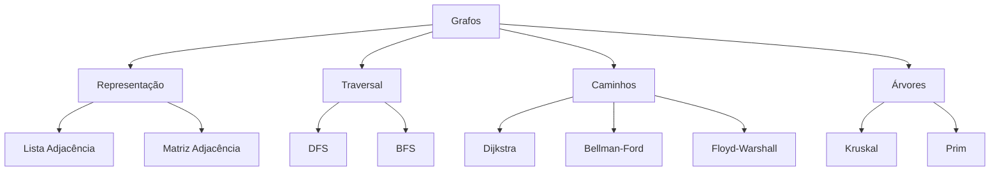

Here's the corrected and improved version of your Obsidian Markdown for graph data structures:

> [!info] Contexto 
> **Disciplina**: [[Estrutura de Dados]]  
> **Pré-requisitos**: [[Recursão]], [[Pilhas (Stack)]], [[Filas (Queue)]]  
> **Próximo tópico**: [[Programação Dinâmica]]

## 🎯 Mapa de Conceitos



## 📚 Definições e Conceitos Base

> [!note] Definição - Grafo
> Um **grafo** G = (V, E) é uma estrutura composta por:
> - **V**: Conjunto de vértices (nodes)
> - **E**: Conjunto de arestas (edges) que conectam os vértices

### 🏷️ Tipos de Grafos

| Tipo               | Características                     | Exemplo de Uso          |
|--------------------|-------------------------------------|-------------------------|
| **Direcionado**    | Arestas têm direção                | Redes sociais (seguir)  |
| **Não-direcionado**| Arestas bidirecionais              | Redes de amizade        |
| **Ponderado**      | Arestas têm peso                   | Mapas com distâncias    |
| **Conexo**         | Existe caminho entre quaisquer dois vértices | Redes de transporte |

## 🛠️ Representações de Grafos

### Lista de Adjacência

```cpp
// Implementação com vector
vector<vector<int>> adj(n);
adj[u].push_back(v); // Adiciona aresta u -> v
```

### Matriz de Adjacência

```cpp
// Implementação com array 2D
bool adj[MAXN][MAXN];
adj[u][v] = true; // Adiciona aresta u -> v
```

> [!tip] Quando usar cada representação?
> - **Lista**: Grafos esparsos (poucas arestas) - O(V + E) espaço
> - **Matriz**: Grafos densos ou consultas frequentes - O(V²) espaço

## 🔍 Algoritmos de Traversal

### DFS (Depth-First Search)

**Complexidade**: O(V + E)  
**Aplicações**:
- [[Detecção de Ciclos]]
- [[Componentes Conectados]]
- [[Ordenação Topológica]]

### BFS (Breadth-First Search)


**Complexidade**: O(V + E)  
**Aplicações**:
- [[Menor Caminho em Grafos Não-Ponderados]]
- [[Árvore Geradora de Largura]]

## 🛣️ Algoritmos de Menor Caminho

### Algoritmo de Dijkstra

> [!warning] Limitação
> Funciona apenas com **pesos não-negativos**

```cpp
vector<int> dijkstra(int start, vector<vector<pair<int,int>>>& adj) {
    int n = adj.size();
    vector<int> dist(n, INF);
    priority_queue<pair<int,int>, vector<pair<int,int>>, greater<>> pq;
    
    dist[start] = 0;
    pq.push({0, start});
    
    while (!pq.empty()) {
        int d = pq.top().first;
        int u = pq.top().second;
        pq.pop();
        
        if (d > dist[u]) continue;
        
        for (auto& edge : adj[u]) {
            int v = edge.first;
            int w = edge.second;
            
            if (dist[u] + w < dist[v]) {
                dist[v] = dist[u] + w;
                pq.push({dist[v], v});
            }
        }
    }
    return dist;
}
```

**Complexidade**: O((V + E) log V)

> [!success] Aplicações Práticas
> - GPS e sistemas de navegação
> - Roteamento em redes
> - Jogos (pathfinding)

## 🌳 Árvores Geradoras Mínimas (MST)

> [!info] Definição
> Uma **MST** é uma subárvore de um grafo conexo que conecta todos os vértices com o menor peso total possível.

### Algoritmo de Kruskal

```cpp
// Estrutura Union-Find necessária
class UnionFind {
    vector<int> parent, rank;
public:
    UnionFind(int n) : parent(n), rank(n, 0) {
        iota(parent.begin(), parent.end(), 0);
    }
    
    int find(int x) {
        return parent[x] == x ? x : parent[x] = find(parent[x]);
    }
    
    bool unite(int x, int y) {
        x = find(x); y = find(y);
        if (x == y) return false;
        
        if (rank[x] < rank[y]) swap(x, y);
        parent[y] = x;
        if (rank[x] == rank[y]) rank[x]++;
        return true;
    }
};

int kruskal(int n, vector<tuple<int,int,int>>& edges) {
    sort(edges.begin(), edges.end());
    
    UnionFind uf(n);
    int mst_weight = 0;
    int edges_used = 0;
    
    for (auto& [w, u, v] : edges) {
        if (uf.unite(u, v)) {
            mst_weight += w;
            if (++edges_used == n - 1) break;
        }
    }
    
    return mst_weight;
}
```

## 🎯 Checklist de Domínio

### Representações
- [ ] Implementar lista de adjacência ✅
- [ ] Implementar matriz de adjacência ✅

### Traversal
- [ ] DFS recursivo ✅
- [ ] BFS com fila ✅

### Caminhos Mínimos
- [ ] Dijkstra implementado ✅

### MST
- [ ] Kruskal com Union-Find ✅

**Legenda**: ✅ Concluído | ⏳ Em progresso | 🔲 Pendente

## 📊 Complexidades Resumidas

| Algoritmo       | Tempo           | Espaço  |
|-----------------|-----------------|---------|
| **DFS**         | O(V + E)        | O(V)    |
| **BFS**         | O(V + E)        | O(V)    |
| **Dijkstra**    | O((V+E)log V)   | O(V)    |
| **Kruskal**     | O(E log E)      | O(V)    |

## 🔗 Conexões

**Pré-requisitos**:
- [[Recursão]] - Para DFS
- [[Filas (Queue)]] - Para BFS

**Aplicações em**:
- [[Redes Sociais]] - Análise de influência
- [[Sistemas de Recomendação]] - Grafos de similaridade

> [!summary] Status Atual 
> **Progresso**: 75% 🟡  
> **Última revisão**: 2025-01-15  
> **Dificuldade percebida**: ⭐⭐⭐⭐

#estrutura-dados #grafos #algoritmos