 `#ml-boosting` `#ensemble-methods` `#classification`

## 📌 Definição Rápida

**AdaBoost (Adaptive Boosting)** é um algoritmo de ensemble que combina múltiplos classificadores fracos (ex: Decision Stumps) em um classificador forte através de um processo iterativo que foca nos exemplos mais difíceis.

- **Tipo**: Boosting (Ensemble Aditivo)
- **Caso de uso ideal**: Classificação binária (com extensões para multiclass)
- **Base comum**: Stumps (árvores com profundidade 1)

## 🎯 Intuição Visual

```mermaid
flowchart TD
    A[Início: Pesos iguais<br>para todas amostras] --> B[Treinar classificador fraco]
    B --> C{Analisar erros}
    C -->|Aumentar peso<br>dos errados| D[Próximo foca nos difíceis]
    D --> E[Repetir T vezes]
    E --> F[Votação ponderada final]
```



## 🧮 Matemática Passo a Passo (Binário)

**Dataset**: $(x_i, y_i)_{i=1}^N$ com $y_i \in \{-1, +1\}$

1. **Inicialização**:
   $$w_i^{(1)} = \frac{1}{N} \quad \text{para } i = 1,\dots,N$$

2. **Para $t = 1$ até $T$**:
   - Treina $h_t(x) \in \{-1, +1\}$ com pesos $w^{(t)}$
   - Calcula erro ponderado:
     $$\varepsilon_t = \sum_{i=1}^N w_i^{(t)} \cdot \mathbf{1}(h_t(x_i) \ne y_i)$$
   - Calcula peso do classificador:
     $$\alpha_t = \frac{1}{2} \ln\left(\frac{1-\varepsilon_t}{\varepsilon_t}\right)$$
   - Atualiza pesos:
     $$w_i^{(t+1)} = w_i^{(t)} \cdot \exp\left(-\alpha_t y_i h_t(x_i)\right)$$
   - Normaliza: $w_i^{(t+1)} = \frac{w_i^{(t+1)}}{\sum_j w_j^{(t+1)}}$

3. **Classificador Final**:
   $$H(x) = \operatorname{sign}\left(\sum_{t=1}^T \alpha_t h_t(x)\right)$$

> [!warning] ⚠️ **Tratamento de casos especiais**: 
> - Se $\varepsilon_t = 0$: classificador perfeito → alpha grande
> - Se $\varepsilon_t \ge 0.5$: pior que aleatório → parar iteração

## 💻 Implementação Manual (Python)

```python
import numpy as np
from sklearn.tree import DecisionTreeClassifier

class AdaBoostManual:
    def __init__(self, n_estimators=50):
        self.n_estimators = n_estimators
        self.learners = []
        self.alphas = []
    
    def _to_pm1(self, y):
        """Converte labels para {-1, +1}"""
        classes = np.unique(y)
        if len(classes) != 2:
            raise ValueError("Apenas para classificação binária")
        return np.where(y == classes[0], -1, +1)
    
    def fit(self, X, y):
        y_pm1 = self._to_pm1(y)
        n_samples = X.shape[0]
        w = np.ones(n_samples) / n_samples
        
        for t in range(self.n_estimators):
            # Treina stump
            stump = DecisionTreeClassifier(max_depth=1, max_features=1)
            stump.fit(X, y_pm1, sample_weight=w)
            pred = stump.predict(X)
            
            # Calcula erro
            err = w[(pred != y_pm1)].sum()
            
            # Condições de parada
            if err == 0:
                alpha = 1e10
                self.learners.append(stump)
                self.alphas.append(alpha)
                break
            if err >= 0.5:
                break
                
            # Calcula alpha
            alpha = 0.5 * np.log((1 - err) / err)
            
            # Atualiza pesos
            w = w * np.exp(-alpha * y_pm1 * pred)
            w = w / w.sum()
            
            self.learners.append(stump)
            self.alphas.append(alpha)
        
        return self
    
    def predict(self, X):
        preds = np.zeros(X.shape[0])
        for stump, alpha in zip(self.learners, self.alphas):
            preds += alpha * stump.predict(X)
        return np.sign(preds)

# Exemplo de uso
ada = AdaBoostManual(n_estimators=50)
ada.fit(X_train, y_train)
y_pred = ada.predict(X_test)
```

## 🚀 Uso com Scikit-learn (Produção)

```python
from sklearn.ensemble import AdaBoostClassifier
from sklearn.tree import DecisionTreeClassifier
from sklearn.datasets import make_classification
from sklearn.model_selection import train_test_split, GridSearchCV
from sklearn.metrics import classification_report, confusion_matrix

# Dataset exemplo
X, y = make_classification(n_samples=1000, n_features=20, random_state=42)
X_train, X_test, y_train, y_test = train_test_split(X, y, test_size=0.2, random_state=42)

# Modelo básico
base_estimator = DecisionTreeClassifier(max_depth=1)
ada = AdaBoostClassifier(
    estimator=base_estimator,
    n_estimators=100,
    learning_rate=0.8,
    random_state=42
)

ada.fit(X_train, y_train)

# Avaliação
print("Acurácia:", ada.score(X_test, y_test))
print(classification_report(y_test, ada.predict(X_test)))
```

### 🔧 Otimização com Grid Search

```python
# Hiperparâmetros para tunar
param_grid = {
    'n_estimators': [50, 100, 200],
    'learning_rate': [0.5, 0.8, 1.0, 1.2],
    'estimator__max_depth': [1, 2]  # profundidade do weak learner
}

grid = GridSearchCV(
    AdaBoostClassifier(DecisionTreeClassifier(), random_state=42),
    param_grid,
    cv=5,
    scoring='accuracy',
    n_jobs=-1
)

grid.fit(X_train, y_train)
print("Melhores parâmetros:", grid.best_params_)
```

## 📈 Monitoramento e Diagnóstico

```python
import matplotlib.pyplot as plt

# Evolução do aprendizado
train_scores = []
test_scores = []

for train_score, test_score in zip(ada.staged_score(X_train, y_train), 
                                  ada.staged_score(X_test, y_test)):
    train_scores.append(train_score)
    test_scores.append(test_score)

plt.figure(figsize=(10, 6))
plt.plot(train_scores, label='Train')
plt.plot(test_scores, label='Test')
plt.xlabel('Número de Estimadores')
plt.ylabel('Acurácia')
plt.title('Evolução do AdaBoost')
plt.legend()
plt.grid(True)
plt.show()

# Feature Importance
plt.figure(figsize=(10, 6))
plt.barh(range(len(ada.feature_importances_)), ada.feature_importances_)
plt.xlabel('Importância')
plt.title('Feature Importance - AdaBoost')
plt.show()
```

## 🔄 SAMME vs SAMME.R (Multiclass)

| Característica | SAMME | SAMME.R |
|----------------|-------|---------|
| **Tipo de saída** | Labels | Probabilidades |
| **Convergência** | Mais lenta | Mais rápida |
| **Requisitos** | Qualquer base learner | Base learner com `predict_proba` |
| **Recomendação** | Usar quando base não tem probas | **Default** - preferir quando possível |

```python
# Para problemas multiclass
ada_multiclass = AdaBoostClassifier(
    estimator=DecisionTreeClassifier(max_depth=2),
    n_estimators=100,
    algorithm='SAMME.R',  # ou 'SAMME'
    random_state=42
)
```

## ⚙️ Hiperparâmetros Críticos

| Parâmetro | Efeito | Valores Típicos |
|-----------|--------|-----------------|
| `n_estimators` | Número de weak learners | 50-500 |
| `learning_rate` | Regularização (shrinkage) | 0.1-1.0 |
| `estimator` | Tipo de weak learner | `DecisionTreeClassifier(max_depth=1)` |
| `algorithm` | Algoritmo multiclass | `'SAMME.R'` (default) |

**Dica prática**: `learning_rate` baixo + `n_estimators` alto geralmente performa melhor.

## ✅ Vantagens vs ❌ Desvantagens

### ✅ **Vantagens**
- Simples e intuitivo
- Boa acurácia com pouco tuning
- Converte weak learners em strong learners
- Feature importance natural

### ❌ **Desvantagens**
- Sensível a ruído e outliers
- Pode overfit com weak learners muito fortes
- Performance inferior a GBM modernos em datasets grandes

## 🆚 AdaBoost vs Gradient Boosting

| Aspecto | AdaBoost | Gradient Boosting |
|---------|----------|-------------------|
| **Objetivo** | Minimizar loss exponencial | Minimizar qualquer loss diferenciável |
| **Atualização** | Pesos das amostras | Resíduos/gradientes |
| **Flexibilidade** | Limitada | Alta |
| **Regularização** | Learning rate | Shrinkage, subsample, constraints |
| **Implementações** | Scikit-learn | XGBoost, LightGBM, CatBoost |

## 🎯 Quando Usar AdaBoost

- **✅ Use quando**:
  - Baseline rápido para problemas tabulares
  - Recursos computacionais limitados
  - Problemas com weak learners naturais (ex: features categóricas)
  - Ensino/conceitos de boosting

- **❌ Evite quando**:
  - Dataset muito grande (>100K amostras)
  - Muito ruído nos labels
  - Performance de estado da arte é crítica

## 🚨 Armadilhas Comuns

1. **Weak learners muito fortes** → overfit rápido
2. **Learning rate muito alto** → overfit
3. **Ignorar ruído nos labels** → foco nos outliers
4. **Não usar early stopping** → treino desnecessariamente longo
