# Guia Completo: Redes Neurais Convolucionais (CNN)

> [!info] Introdução As **Convolutional Neural Networks (CNNs)** são um tipo especializado de rede neural artificial especialmente eficaz para processamento de dados que possuem estrutura em grade, como **imagens**. Elas revolucionaram áreas como visão computacional, reconhecimento de imagem e processamento de vídeo.

---

## 🧠 O que são CNNs?

> [!abstract] Conceito Base CNNs são **inspiradas pelo córtex visual** dos mamíferos. Elas conseguem **detectar padrões locais** em imagens através de operações matemáticas chamadas **convoluções**, preservando as relações espaciais entre pixels.

### Por que CNNs são Superiores para Imagens?

|Problema das Redes Densas|Solução das CNNs|
|---|---|
|**Muitos parâmetros**: Uma imagem 224x224x3 = 150k neurônios|**Compartilhamento de parâmetros**: Filtros reutilizados|
|**Perda da informação espacial**: Pixels são "achatados"|**Preservação espacial**: Mantém vizinhança|
|**Não invariante a translação**: Mesmo objeto em posição diferente|**Invariância**: Detecta padrões independente da posição|

---

## 🔧 Componentes Fundamentais

### 1. **Convolução (Convolution)**

> [!note] Operação Matemática Core A **convolução** é uma operação matemática que combina duas funções para produzir uma terceira. Em CNNs, aplicamos um **filtro (kernel)** sobre uma **imagem** para detectar características específicas.

#### Fórmula da Convolução 2D

$$
(I * K)(i,j) = ∑∑ I(i+m, j+n) × K(m,n)
               m n
$$

Onde:

- **I**: Imagem de entrada
- **K**: Kernel (filtro)
- **(i,j)**: Posição na imagem resultante

#### Exemplo Visual da Convolução

> [!example] Detecção de Bordas Verticais **Imagem 6x6:**
> 
> ```
> 3 0 1 2 7 4
> 1 5 8 9 3 1
> 2 7 2 5 1 4
> 0 1 3 1 7 8
> 4 2 1 6 2 8
> 2 3 2 1 2 3
> ```
> 
> **Filtro 3x3 (Sobel Vertical):**
> 
> ```
> -1  0  1
> -1  0  1
> -1  0  1
> ```
> 
> **Resultado da Convolução:**
> 
> ```
>  4  -5  -2   8
>  2  -3  -2   3
> -3  -1   4   6
>  4   2   2   4
> ```

### 2. **Kernels/Filtros**

> [!important] Detectores de Características **Kernels** são pequenas matrizes (geralmente 3x3, 5x5, 7x7) que detectam características específicas como bordas, texturas e formas.

#### Tipos Comuns de Filtros

|Filtro|Matriz 3x3|Função|
|---|---|---|
|**Sobel X**|`[[-1,0,1],[-2,0,2],[-1,0,1]]`|Detecta bordas horizontais|
|**Sobel Y**|`[[-1,-2,-1],[0,0,0],[1,2,1]]`|Detecta bordas verticais|
|**Gaussian Blur**|`[[1,2,1],[2,4,2],[1,2,1]]/16`|Suavização|
|**Sharpen**|`[[0,-1,0],[-1,5,-1],[0,-1,0]]`|Acentua detalhes|
|**Edge Detection**|`[[-1,-1,-1],[-1,8,-1],[-1,-1,-1]]`|Detecta todas as bordas|

> [!tip] Aprendizado Automático Em CNNs, os **valores dos kernels são aprendidos automaticamente** durante o treinamento, não programados manualmente!

### 3. **Camadas Convolucionais (Convolutional Layers)**

> [!abstract] Estrutura Básica As **camadas convolucionais** aplicam múltiplos filtros na imagem de entrada, produzindo **mapas de características (feature maps)** que destacam diferentes aspectos da imagem.

#### Parâmetros Importantes

##### **Padding**

- **Same Padding**: Adiciona zeros nas bordas para manter o tamanho
- **Valid Padding**: Não adiciona padding, reduz o tamanho

```
Sem Padding (Valid):  Entrada 5x5 → Saída 3x3 (com kernel 3x3)
Com Padding (Same):   Entrada 5x5 → Saída 5x5 (com kernel 3x3)
```

##### **Stride**

- **Stride 1**: Move o filtro pixel por pixel
- **Stride 2**: Move o filtro de 2 em 2 pixels

```
Stride 1: Entrada 7x7 → Saída 5x5 (kernel 3x3)
Stride 2: Entrada 7x7 → Saída 3x3 (kernel 3x3)
```

#### Cálculo do Tamanho de Saída

```
Tamanho_Saída = (Entrada + 2×Padding - Kernel) / Stride + 1
```

> [!example] Exemplo Prático **Entrada**: 32x32, **Kernel**: 5x5, **Padding**: 2, **Stride**: 1
> 
> **Cálculo**: $(32 + 2×2 - 5) / 1 + 1 = 32$
> 
> **Resultado**: Saída 32x32 (mesmo tamanho da entrada)

### 4. **Camadas de Pooling**

> [!note] Redução Dimensional **Pooling** reduz o tamanho espacial dos mapas de características, diminuindo parâmetros e evitando overfitting.

#### Tipos de Pooling

##### **Max Pooling**

Pega o **valor máximo** em cada região:

```
Entrada 4x4:          Max Pooling 2x2:
1  3  2  4            →    3  4
2  9  1  1                 8  3
1  8  7  3
0  2  4  1
```

##### **Average Pooling**

Calcula a **média** em cada região:

```
Entrada 4x4:          Avg Pooling 2x2:
4  2  1  3            →    3.75  2
1  6  3  2                 2.75  3
2  4  1  4
1  1  6  2
```

> [!success] Benefícios do Pooling
> 
> - **Reduz overfitting**: Menos parâmetros para aprender
> - **Invariância posicional**: Pequenas translações não afetam resultado
> - **Reduz custo computacional**: Menos dados para processar
> - **Aumenta campo receptivo**: Cada neurônio "vê" área maior da imagem original

### 5. **Função de Ativação**

> [!important] Não-Linearidade Funções de ativação introduzem **não-linearidade** na rede, permitindo que ela aprenda padrões complexos.

#### **ReLU (Rectified Linear Unit)** - Mais Comum

```python
ReLU(x) = max(0, x)
```

**Vantagens:**

- Simples de calcular
- Evita problema do gradiente desvanescente
- Esparsidade natural (muitos zeros)

#### **Outras Ativações**

- **Leaky ReLU**: `f(x) = max(0.01x, x)`
- **ELU**: Exponential Linear Unit
- **Swish**: `f(x) = x × sigmoid(x)`

---

## 🏗️ Arquitetura Típica de uma CNN

> [!abstract] Estrutura em Blocos Uma CNN típica combina camadas de diferentes tipos em uma arquitetura hierárquica:

```mermaid
graph LR
    A[Imagem de Entrada<br/>224x224x3] --> B[Conv Layer 1<br/>64 filtros 3x3]
    B --> C[ReLU]
    C --> D[Conv Layer 2<br/>64 filtros 3x3]
    D --> E[ReLU]
    E --> F[Max Pool<br/>2x2]
    F --> G[Conv Layer 3<br/>128 filtros 3x3]
    G --> H[ReLU]
    H --> I[Max Pool<br/>2x2]
    I --> J[Flatten]
    J --> K[Dense Layer<br/>512 neurônios]
    K --> L[ReLU]
    L --> M[Dense Layer<br/>10 classes]
    M --> N[Softmax]
    
    style A fill:#e1f5fe
    style F fill:#fff3e0
    style I fill:#fff3e0
    style J fill:#f3e5f5
    style N fill:#e8f5e8
```



### Evolução das Dimensões

|Camada|Entrada|Saída|Parâmetros|
|---|---|---|---|
|**Input**|-|224×224×3|0|
|**Conv1**|224×224×3|224×224×64|1,792|
|**Pool1**|224×224×64|112×112×64|0|
|**Conv2**|112×112×64|112×112×128|73,856|
|**Pool2**|112×112×128|56×56×128|0|
|**Flatten**|56×56×128|401,408|0|
|**Dense**|401,408|512|205,521,408|
|**Output**|512|10|5,130|

---

## 💻 Exemplo Prático: CNN para Classificação de Dígitos

### Implementação Completa em Python

```python
import tensorflow as tf
from tensorflow.keras import layers, models
import numpy as np
import matplotlib.pyplot as plt

# ============================================================================
# 1. PREPARAÇÃO DOS DADOS
# ============================================================================

# Carrega dataset MNIST (dígitos escritos à mão)
(x_train, y_train), (x_test, y_test) = tf.keras.datasets.mnist.load_data()

print(f"Shape dos dados de treino: {x_train.shape}")
print(f"Shape das labels de treino: {y_train.shape}")
print(f"Shape dos dados de teste: {x_test.shape}")

# Normaliza os pixels para [0, 1]
x_train = x_train.astype('float32') / 255.0
x_test = x_test.astype('float32') / 255.0

# Adiciona dimensão de canal (28, 28) -> (28, 28, 1)
x_train = x_train[..., tf.newaxis]
x_test = x_test[..., tf.newaxis]

print(f"Shape após reshape: {x_train.shape}")

# ============================================================================
# 2. CONSTRUÇÃO DA CNN
# ============================================================================

def criar_cnn_modelo():
    """
    Cria uma CNN simples para classificação de dígitos MNIST
    """
    model = models.Sequential([
        # Primeira camada convolucional
        layers.Conv2D(filters=32,           # 32 filtros diferentes
                     kernel_size=(3, 3),    # Kernels 3x3
                     activation='relu',     # Função de ativação ReLU
                     input_shape=(28, 28, 1)),  # Entrada: 28x28x1
        
        # Primeira camada de pooling
        layers.MaxPooling2D(pool_size=(2, 2)),  # Reduz para metade
        
        # Segunda camada convolucional
        layers.Conv2D(filters=64,           # 64 filtros
                     kernel_size=(3, 3),    # Kernels 3x3
                     activation='relu'),
        
        # Segunda camada de pooling
        layers.MaxPooling2D(pool_size=(2, 2)),
        
        # Terceira camada convolucional
        layers.Conv2D(filters=64,
                     kernel_size=(3, 3),
                     activation='relu'),
        
        # Achata para conectar com camadas densas
        layers.Flatten(),
        
        # Camada densa (fully connected)
        layers.Dense(64, activation='relu'),
        
        # Camada de saída (10 classes para dígitos 0-9)
        layers.Dense(10, activation='softmax')  # Softmax para probabilidades
    ])
    
    return model

# Cria o modelo
modelo = criar_cnn_modelo()

# Mostra arquitetura do modelo
modelo.summary()

# ============================================================================
# 3. COMPILAÇÃO E TREINAMENTO
# ============================================================================

# Compila o modelo
modelo.compile(
    optimizer='adam',                    # Otimizador Adam
    loss='sparse_categorical_crossentropy',  # Loss para classificação
    metrics=['accuracy']                 # Métrica de acurácia
)

print("Iniciando treinamento...")

# Treina o modelo
history = modelo.fit(
    x_train, y_train,
    epochs=5,                    # 5 épocas de treinamento
    batch_size=32,               # 32 amostras por batch
    validation_split=0.2,        # 20% para validação
    verbose=1                    # Mostra progresso
)

# ============================================================================
# 4. AVALIAÇÃO
# ============================================================================

# Avalia no conjunto de teste
test_loss, test_accuracy = modelo.evaluate(x_test, y_test, verbose=0)
print(f"\nAcurácia no teste: {test_accuracy:.4f}")
print(f"Loss no teste: {test_loss:.4f}")

# ============================================================================
# 5. VISUALIZAÇÃO DOS RESULTADOS
# ============================================================================

def plot_training_history(history):
    """Plota histórico de treinamento"""
    
    fig, (ax1, ax2) = plt.subplots(1, 2, figsize=(12, 4))
    
    # Acurácia
    ax1.plot(history.history['accuracy'], label='Treino', color='blue')
    ax1.plot(history.history['val_accuracy'], label='Validação', color='red')
    ax1.set_title('Acurácia do Modelo')
    ax1.set_xlabel('Época')
    ax1.set_ylabel('Acurácia')
    ax1.legend()
    ax1.grid(True)
    
    # Loss
    ax2.plot(history.history['loss'], label='Treino', color='blue')
    ax2.plot(history.history['val_loss'], label='Validação', color='red')
    ax2.set_title('Loss do Modelo')
    ax2.set_xlabel('Época')
    ax2.set_ylabel('Loss')
    ax2.legend()
    ax2.grid(True)
    
    plt.tight_layout()
    plt.show()

# Plota histórico
plot_training_history(history)

# ============================================================================
# 6. TESTANDO COM EXEMPLOS
# ============================================================================

def testar_predicoes(modelo, x_test, y_test, num_exemplos=10):
    """Testa predições em exemplos aleatórios"""
    
    # Seleciona exemplos aleatórios
    indices = np.random.choice(len(x_test), num_exemplos, replace=False)
    
    # Faz predições
    predicoes = modelo.predict(x_test[indices])
    predicoes_classes = np.argmax(predicoes, axis=1)
    
    # Visualiza resultados
    fig, axes = plt.subplots(2, 5, figsize=(15, 6))
    axes = axes.ravel()
    
    for i, idx in enumerate(indices):
        # Mostra imagem
        axes[i].imshow(x_test[idx].squeeze(), cmap='gray')
        axes[i].set_title(f'Real: {y_test[idx]}\nPredição: {predicoes_classes[i]}\n'
                         f'Confiança: {np.max(predicoes[i]):.2f}')
        axes[i].axis('off')
        
        # Colore borda baseado na predição
        if predicoes_classes[i] == y_test[idx]:
            axes[i].patch.set_edgecolor('green')  # Correto
        else:
            axes[i].patch.set_edgecolor('red')    # Incorreto
        axes[i].patch.set_linewidth(3)
    
    plt.tight_layout()
    plt.show()

# Testa predições
testar_predicoes(modelo, x_test, y_test)

# ============================================================================
# 7. VISUALIZAÇÃO DOS FILTROS APRENDIDOS
# ============================================================================

def visualizar_filtros(modelo, camada=0):
    """Visualiza os filtros aprendidos na primeira camada convolucional"""
    
    # Extrai pesos da primeira camada convolucional
    filters = modelo.layers[camada].get_weights()[0]
    
    print(f"Shape dos filtros: {filters.shape}")
    
    # Normaliza filtros para visualização
    f_min, f_max = filters.min(), filters.max()
    filters = (filters - f_min) / (f_max - f_min)
    
    # Plota primeiros 16 filtros
    n_filters = min(16, filters.shape[-1])
    fig, axes = plt.subplots(4, 4, figsize=(12, 12))
    axes = axes.ravel()
    
    for i in range(n_filters):
        axes[i].imshow(filters[:, :, 0, i], cmap='viridis')
        axes[i].set_title(f'Filtro {i+1}')
        axes[i].axis('off')
    
    plt.suptitle('Filtros Aprendidos na Primeira Camada Convolucional', 
                 fontsize=16)
    plt.tight_layout()
    plt.show()

# Visualiza filtros
visualizar_filtros(modelo)

# ============================================================================
# 8. ANÁLISE DE FEATURE MAPS
# ============================================================================

def visualizar_feature_maps(modelo, x_test, indice=0):
    """Visualiza os feature maps de uma imagem específica"""
    
    # Seleciona uma imagem
    img = x_test[indice:indice+1]
    
    # Cria modelo para extrair feature maps
    layer_outputs = [layer.output for layer in modelo.layers[:4]]  # Primeiras 4 camadas
    activation_model = models.Model(inputs=modelo.input, outputs=layer_outputs)
    
    # Obtém ativações
    activations = activation_model.predict(img)
    
    layer_names = ['Conv2D_1', 'MaxPool_1', 'Conv2D_2', 'MaxPool_2']
    
    for layer_name, activation in zip(layer_names, activations):
        if len(activation.shape) == 4:  # Camadas convolucionais
            n_features = min(8, activation.shape[-1])  # Mostra até 8 mapas
            
            fig, axes = plt.subplots(2, 4, figsize=(16, 8))
            axes = axes.ravel()
            
            for i in range(n_features):
                axes[i].imshow(activation[0, :, :, i], cmap='viridis')
                axes[i].set_title(f'Feature Map {i+1}')
                axes[i].axis('off')
            
            # Remove eixos extras
            for i in range(n_features, 8):
                axes[i].axis('off')
                
            plt.suptitle(f'Feature Maps - {layer_name}', fontsize=16)
            plt.tight_layout()
            plt.show()

# Visualiza feature maps
print("Visualizando feature maps...")
visualizar_feature_maps(modelo, x_test, indice=0)

print("\n" + "="*60)
print("ANÁLISE COMPLETA DA CNN FINALIZADA!")
print("="*60)
```

---

## 📊 Arquiteturas CNN Famosas

> [!example] Marcos Históricos Algumas arquiteturas revolucionaram o campo de visão computacional:

### **[[LeNet-5]] (1998)**

- **Propósito**: Reconhecimento de dígitos
- **Estrutura**: 2 Conv + 2 FC
- **Tamanho**: ~60k parâmetros

### **[[AlexNet]] (2012)**

- **Revolução**: Primeira CNN a vencer ImageNet
- **Inovações**: ReLU, Dropout, GPU training
- **Tamanho**: ~60M parâmetros

### **[[VGGNet]] (2014)**

- **Características**: Filtros 3x3, arquitetura profunda
- **Variantes**: VGG-16, VGG-19
- **Tamanho**: ~138M parâmetros

### **[[ResNet]] (2015)**

- **Inovação**: Conexões residuais (skip connections)
- **Profundidade**: Até 152 camadas
- **Problema resolvido**: Degradação em redes muito profundas

### **[[EfficientNet]] (2019)**

- **Abordagem**: Scaling balanceado (largura, profundidade, resolução)
- **Eficiência**: Melhor acurácia com menos parâmetros

---

## 🎯 Aplicações Práticas das CNNs

### **Visão Computacional**

- ✅ **Classificação de imagens**: Identificar objetos em fotos
- ✅ **Detecção de objetos**: Localizar e classificar múltiplos objetos
- ✅ **Segmentação**: Identificar pixels pertencentes a cada objeto
- ✅ **Reconhecimento facial**: Identificação e verificação de pessoas

### **Medicina**

- 🏥 **Diagnóstico por imagem**: Raio-X, tomografias, ressonâncias
- 🏥 **Detecção de câncer**: Análise de biópsias e exames
- 🏥 **Análise de retina**: Detecção de doenças oculares

### **Carros Autônomos**

- 🚗 **Detecção de pedestres**: Segurança em tempo real
- 🚗 **Reconhecimento de sinais**: Placas de trânsito
- 🚗 **Segmentação de pista**: Identificação da estrada

### **Arte e Criatividade**

- 🎨 **Style Transfer**: Aplicar estilo artístico a fotos
- 🎨 **Geração de imagens**: GANs para criar arte artificial
- 🎨 **Super-resolução**: Aumentar qualidade de imagens

---

## ⚡ Dicas e Melhores Práticas

### **Preparação de Dados**

> [!tip] Qualidade dos Dados
> 
> - **Normalização**: Sempre normalize pixels para [0,1] ou [-1,1]
> - **Data Augmentation**: Rotação, zoom, flip para aumentar dataset
> - **Balanceamento**: Garanta classes equilibradas
> - **Validação**: Sempre separe dados de treino/validação/teste

### **Arquitetura**

> [!success] Design Eficiente
> 
> - **Comece simples**: Poucas camadas, depois aumente complexidade
> - **Batch Normalization**: Acelera treinamento e melhora estabilidade
> - **Dropout**: Evita overfitting em camadas densas
> - **Skip Connections**: Para redes muito profundas (ResNet style)

### **Treinamento**

> [!important] Otimização
> 
> - **Learning Rate**: Comece com 0.001 (Adam) ou 0.01 (SGD)
> - **Early Stopping**: Pare se validação não melhora
> - **Learning Rate Decay**: Reduza gradualmente durante treino
> - **Checkpoints**: Salve melhor modelo durante treinamento

### **Debugging**

> [!warning] Problemas Comuns
> 
> - **Overfitting**: Loss de treino ≪ loss de validação
>     - _Solução_: Mais dados, dropout, regularização
> - **Underfitting**: Ambos os losses altos
>     - _Solução_: Modelo mais complexo, menos regularização
> - **Gradiente explodindo**: Loss vira NaN
>     - _Solução_: Learning rate menor, gradient clipping

---

## 🔬 Matemática por Trás das CNNs

### **Backpropagation em CNNs**

> [!note] Gradientes nas Convoluções Durante o treinamento, os gradientes são propagados através das camadas convolucionais usando a regra da cadeia:

```
∂L/∂w = ∂L/∂y ⊗ x
∂L/∂x = w_rotated ⊗ ∂L/∂y
```

Onde:

- **L**: Loss function
- **w**: Pesos do kernel
- **x**: Entrada da camada
- **y**: Saída da camada
- **⊗**: Operação de convolução

### **Cálculo de Parâmetros**

Para uma camada convolucional:

```
Parâmetros = (kernel_height × kernel_width × input_channels + 1) × output_channels
```

> [!example] Exemplo **Entrada**: 224×224×3, **Filtros**: 64 de 3×3
> 
> **Cálculo**: (3 × 3 × 3 + 1) × 64 = 1,792 parâmetros

---

## 📚 Resumo e Conclusões

> [!success] Pontos-Chave das CNNs
> 
> 1. **Convoluções** detectam características locais usando filtros aprendidos
> 2. **Pooling** reduz dimensionalidade e adiciona invariância
> 3. **Hierarquia** permite detecção de padrões simples → complexos
> 4. **Compartilhamento de parâmetros** reduz overfitting
> 5. **Translação invariante** detecta objetos independente da posição

> [!quote] Impacto das CNNs "As CNNs não apenas revolucionaram a visão computacional, mas abriram caminho para aplicações de IA que pareciam ficção científica há duas décadas. Desde diagnósticos médicos até carros autônomos, elas são a espinha dorsal da revolução visual da inteligência artificial."

> [!info] Próximos Passos Para aprofundar seus conhecimentos:
> 
> - Experimente com diferentes arquiteturas (ResNet, DenseNet, EfficientNet)
> - Aprenda sobre **Transfer Learning** para problemas reais
> - Explore **GANs** para geração de imagens
> - Estude **Object Detection** (YOLO, R-CNN)
> - Pratique com datasets reais (ImageNet, COCO, CIFAR)
# 📚 Guia de Arquiteturas CNN

> [!info] O que é este guia?
> Este documento reúne as principais arquiteturas de Redes Neurais Convolucionais (CNNs), divididas por categoria, com informações sobre ano, objetivo e disponibilidade no **Keras** e **PyTorch**.  
> Cada nome está linkado para um note próprio.

---

## 📜 Arquiteturas Clássicas
> [!abstract]
> São as redes que marcaram época e serviram de base para modelos mais avançados.

| Arquitetura | Ano | Objetivo Principal | Keras | PyTorch |
|-------------|-----|--------------------|-------|---------|
| [[LeNet-5]] | 1998 | Reconhecimento de dígitos (MNIST) | ✅ | ✅ |
| [[AlexNet]] | 2012 | Classificação ImageNet | ✅ | ✅ |
| [[ZFNet]] | 2013 | Melhorar filtros e visualização | ❌ | ✅ |
| [[VGGNet]] | 2014 | CNN profunda com conv 3×3 | ✅ | ✅ |
| [[GoogLeNet / Inception v1]] | 2014 | Módulos multi-escala | ✅ | ✅ |
| [[Inception v2]] / [[Inception v3]] / [[Inception v4]] | 2015–2016 | Refinamento Inception | ✅ | ✅ |
| [[ResNet]] | 2015 | Conexões residuais | ✅ | ✅ |
| [[ResNeXt]] | 2016 | Versão paralela do ResNet | ❌ | ✅ |
| [[DenseNet]] | 2017 | Conexões densas | ✅ | ✅ |
| [[Xception]] | 2017 | Convoluções separáveis em profundidade | ✅ | ✅ |
| [[ConvNeXt]] | 2022 | CNN moderna inspirada em Transformers | ❌ | ✅ |

---

## 🎯 Arquiteturas para Detecção
> [!tip]
> Usadas para identificar e localizar objetos em imagens.

| Arquitetura | Ano | Objetivo Principal | Keras | PyTorch |
|-------------|-----|--------------------|-------|---------|
| [[R-CNN]] | 2014 | Detecção baseada em regiões | ❌ | ✅ |
| [[Fast R-CNN]] | 2015 | Detecção mais rápida | ❌ | ✅ |
| [[Faster R-CNN]] | 2015 | ROIs + CNN integrada | ❌ | ✅ |
| [[YOLO v1]]–[[YOLO v9]] | 2016–2024 | Detecção em tempo real | ❌ | ✅ |
| [[SSD]] | 2016 | Detecção multi-escala | ❌ | ✅ |
| [[RetinaNet]] | 2017 | Focal Loss para classes raras | ❌ | ✅ |
| [[DETR]] | 2020 | Detecção via Transformer | ❌ | ✅ |

---

## 🩻 Arquiteturas para Segmentação
> [!example]
> Segmentação é o processo de rotular cada pixel da imagem com a classe correspondente.

| Arquitetura | Ano | Objetivo Principal | Keras | PyTorch |
|-------------|-----|--------------------|-------|---------|
| [[FCN]] | 2015 | CNN totalmente convolucional | ❌ | ✅ |
| [[U-Net]] | 2015 | Segmentação biomédica | ✅ | ✅ |
| [[SegNet]] | 2015 | Encoder-decoder com pooling indices | ❌ | ✅ |
| [[DeepLab v1]] / [[DeepLab v2]] / [[DeepLab v3+]] | 2016–2018 | Dilated conv + CRF | ❌ | ✅ |
| [[Mask R-CNN]] | 2017 | Detecção + Segmentação de instâncias | ❌ | ✅ |

---

## 📱 Arquiteturas Leves / Especiais
> [!tip]
> Voltadas para dispositivos móveis, otimização ou propostas inovadoras.

| Arquitetura | Ano | Objetivo Principal | Keras | PyTorch |
|-------------|-----|--------------------|-------|---------|
| [[SqueezeNet]] | 2016 | Modelo pequeno | ❌ | ✅ |
| [[MobileNet v1]] / [[MobileNet v2]] / [[MobileNet v3]] | 2017–2019 | Dispositivos móveis | ✅ | ✅ |
| [[ShuffleNet]] | 2017 | Eficiência por embaralhar canais | ❌ | ✅ |
| [[NASNet]] | 2017 | Busca neural automatizada | ✅ | ✅ |
| [[MnasNet]] | 2018 | Arquitetura via AutoML | ❌ | ✅ |
| [[EfficientNet]] | 2019 | Escalonamento ótimo | ✅ | ✅ |
| [[RegNet]] | 2020 | Redes com regularização sistemática | ❌ | ✅ |
| [[CapsNet]] | 2017 | Redes de cápsulas | ❌ | ✅ |

---

## 🔍 Como usar este guia
> [!important]
> - Clique no nome da arquitetura para abrir o note específico.
> - Prefira modelos **mais leves** se for rodar em celular ou IoT.
> - Modelos de **detecção** e **segmentação** podem ser adaptados para múltiplas tarefas.

---

## 📌 Próximos Passos
> [!todo]
> - [ ] Criar notas individuais para cada arquitetura com detalhes, diagrama e código.  
> - [ ] Expandir o guia para incluir **+40 arquiteturas** intermediárias.  
> - [ ] Criar linha do tempo visual com evolução das CNNs.
