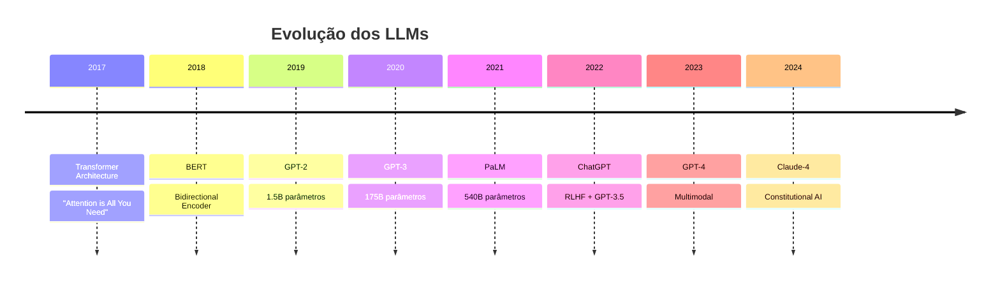

##  Visão Geral

> [!abstract] A Inteligência Artificial é o campo da computação que busca criar sistemas capazes de realizar tarefas que normalmente requerem inteligência humana. Abrange desde algoritmos clássicos até modelos modernos como Large Language Models.

---
# Componentes do Aprendizado de máquina

> [!note] Esses componente são essenciais para "ensinar" uma máquina a detectar padrões
## Dados

> [!note] Dados comparativos, como você ter uma amostra de imagens de um certo objetivo para identificar tal objeto.

> [!example] uma amostra de mensagens de span para detectar um spam

> [!attention] Quanto mais diversos os materiais, melhor o resultado.

> [!note] Existem duas formas de termos os dados:
 > - **Manual**: Dados coletados manualmente. Tem menos erros porém leva mais tempo para coletar (+ CARO)
 >- **Automática**: Reúne tudo que pode encontrar e torce pelo melhor.
 
> [!example] O recaptcha é basicamente vc fornecendo dados para o google para aprendizado.

> [!note] Os conjuntos de dados bons é bem difícil de obter, tanto que as empresas raramente revelam eles.

## Características

> [!note] Conhecidas também como **Parâmetros** ou **variáveis**, é o que a máquina irá analisar em si, como se fosse uma coluna de um certo dado em uma tabela. Elas tentam consideras as que elas acham "mais importantes".

> [!warning] Além de ser as partes importantes, são as principais fonte de erros. MeatBug são sempre subjetivos. Normalmente essa parte pe a mais demorada entre as outras do ML

## Algoritmos

> [!note] TEM QUE OBVIAMENTE TER NESSA POHA, se não seria de fuder. 
> 
> Um certo problema pode ser resolvido de várias maneiras, porém certo fatores serão modificados dependendo do método, como:
>  - Desepenho
>  - Tamanho do modelo final
>  - Presição

> [!warning] Se os dados forem uma merda, nem adiante fazer um ótimo algoritmo. Esse fenômeno é chamado de "Lixo que entra, Lixo que sai"


![[Pasted image 20250810160914.png]]

# Aprendizado VS Inteligência

## Inteligência Artificial
> [!abstract] é o nome de todo um campo do conhecimento, semelhante à biologia ou à química

## Aprendizado de máquina
> [!abstract] faz parte da inteligência artificial. Uma parte importante, mas não a única.

## Redes Neurais
> [!abstract] são um tipo de aprendizado de máquina. Um tipo popular, mas existem outros bons no gênero.

## Deep Learning
> [!abstract] Métodos modernos de construção, treinamento e use e redes neurais, uma arquitetura nova.


![[Pasted image 20250810161445.png]]

| ***Máquina pode***        | ***A máquina não pode***           |
| ------------------------- | ---------------------------------- |
| **Previsão**              | **Crie algo novo**                 |
| **Memorizar**             | **Fique inteligente muito rápido** |
| **Reproduzir**            | **Vá além da sua tarefa**          |
| **Escolha o melhor item** | **Mate todos os humanos**          |
## 📚 Taxonomia de Aprendizado de Máquina

![[Pasted image 20250810161930.png]]

![[Pasted image 20250810162005.png]]

![[Pasted image 20250810162025.png]]

> [!info] Você pode categorizar os métodos de aprendizado com base em algumas categorias como:
> 
>  - Se é visto por humanos ou não ([[ML - Aprendizado Supervisionado]], [[ML - Aprendizado por Reforço]], [[ML - Aprendizado Não-Supervisionado]], [[ML - Aprendizado Semi Supervisionado]])
>  - Se ele aprende de forma incremental online
>  - Se eles funcionam comparando novos pontos de dados com pontos de dados conhecidos, detecte padrões nos dados de treinamento e construa um modelo preditivo. 

### [[ML - Aprendizado Supervisionado]]

**Definição:** Algoritmos que aprendem a partir de dados rotulados (X, y)

**Características:**

- Possui dados de entrada (features) e saída esperada (target)
- Objetivo: mapear função f(X) → y
- Avaliação através de métricas de erro

**Subcategorias:**

- [[ML - Classificação]] → Predição de categorias/classes
- [[ML - Regressão Linear]] → Predição de valores contínuos

### [[ML - Aprendizado Não-Supervisionado]]

**Definição:** Algoritmos que encontram padrões em dados sem rótulos

**Características:**

- Apenas dados de entrada (X), sem target
- Objetivo: descobrir estruturas ocultas nos dados
- Avaliação mais subjetiva

**Subcategorias:**

- [[ML - Clustering]] → Agrupamento de dados similares
- [[ML - Redução de Dimensionalidade]] → Compressão de features
- [[ML - Detecção de Anomalias]] → Identificação de outliers
- [[ML - Regras de Associação]] → Padrões de co-ocorrência


### [[ML - Aprendizado Semi Supervisionado]]

**Definição:** Algoritmos que aprendem a partir de um conjunto misto de dados rotulados e não rotulados.

**Características:**

- Combina dados de entrada (X) com alguns rótulos (Y), porém com quantidade limitada.
- Objetivo: aproveitar a grande massa de dados não rotulados para melhorar a performance.
- Equilibra a rigidez do aprendizado supervisionado e a flexibilidade do não supervisionado.
- Avaliação mais robusta que no não supervisionado, porém menos custosa que no supervisionado.

**Abordagens Comuns:**

- Propagação de rótulos (Label Propagation): dissemina informações dos poucos exemplos rotulados para os demais.
- Autoencoders Semi Supervisionados: modelos que aprendem representações úteis combinando aprendizado supervisionado e não supervisionado.
- Métodos baseados em grafos: exploram a estrutura dos dados para inferir rótulos.
- Algoritmos híbridos que combinam aprendizado supervisionado e não supervisionado.

### [[ML - Aprendizado por Reforço]]

**Definição:** Algoritmos que aprendem através de interação com ambiente

**Características:**

- Agente toma ações em um ambiente
- Recebe recompensas/punições
- Objetivo: maximizar recompensa cumulativa

**Subcategorias:**

- [[RL - Q-Learning]] → Aprendizado de valores de ação
- [[RL - Policy Gradient]] → Otimização direta da política
- [[RL - Actor-Critic]] → Combinação de valor e política

---

## 📊 Matriz de Contextos e Aplicações

| **Paradigma**                         | **Problema**                  | **Algoritmos Principais**                                                                                            | **Métricas de Avaliação**                                                                                                    | **Aplicações Reais**                                                                                   |
| ------------------------------------- | ----------------------------- | -------------------------------------------------------------------------------------------------------------------- | ---------------------------------------------------------------------------------------------------------------------------- | ------------------------------------------------------------------------------------------------------ |
| **Supervisionado - Classificação**    | Categorizar dados em classes  | • Árvores de Decisão<br>• Random Forest<br>• SVM<br>• [[ML - Naive Bayes]] <br>• [[Redes Neurais]]                   | • Acurácia<br>• Precisão/Recall<br>• F1-Score<br>• Matriz de Confusão<br>• ROC-AUC                                           | • Diagnóstico médico<br>• Spam detection<br>• Reconhecimento de imagem<br>• Análise de sentimento      |
| **Supervisionado - Regressão**        | Predizer valores contínuos    | • [[Regressão Linear]]<br>• [[Regressão Logística]]<br>• [[SVR]]<br>• [[Redes Neurais]]<br>• [[Gradient Boosting]]   | • MAE - Mean Absolute Error<br>• MSE - Mean Squared Error<br>• RMSE<br>• [[R² Score]]<br>• [[MAPE]]                          | • Previsão de preços<br>• Estimativa de vendas<br>• Previsão do tempo<br>• Análise financeira          |
| **Não-Supervisionado - Clustering**   | Agrupar dados similares       | • [[K-Means]]<br>• [[Clustering Hierárquico]]<br>• [[DBSCAN]]<br>• [[Gaussian Mixture]]<br>• [[Spectral Clustering]] | • [[Silhouette Score]]<br>• [[Calinski-Harabasz]]<br>• [[Davies-Bouldin]]<br>• [[Inertia/WCSS]]<br>• [[Adjusted Rand Index]] | • Segmentação de clientes<br>• Análise de mercado<br>• Organização de documentos<br>• Análise genética |
| **Não-Supervisionado - Redução Dim.** | Reduzir complexidade          | • [[PCA]]<br>• [[t-SNE]]<br>• [[UMAP]]<br>• [[LDA]]<br>• [[Autoencoders]]                                            | • [[Variância Explicada]]<br>• [[Reconstruction Error]]<br>• [[Stress (t-SNE)]]<br>• [[Trustworthiness]]<br>• [[Continuity]] | • Visualização de dados<br>• Compressão<br>• Pré-processamento<br>• Feature engineering                |
| **Aprendizado por Reforço**           | Otimizar decisões sequenciais | • [[Q-Learning]]<br>• [[Deep Q-Network]]<br>• [[Policy Gradient]]<br>• [[Actor-Critic]]<br>• [[PPO]]                 | • [[Reward Cumulativo]]<br>• [[Episode Length]]<br>• [[Success Rate]]<br>• [[Convergence Time]]<br>• [[Sample Efficiency]]   | • Jogos (AlphaGo)<br>• Carros autônomos<br>• Trading algorítmico<br>• Robótica                         |

---

## 🧠 Deep Learning e Arquiteturas Neurais

### [[Deep Learning - Redes Neurais Profundas]]

#### **Arquiteturas Fundamentais:**

|**Tipo de Rede**|**Estrutura**|**Aplicações**|**Vantagens**|**Limitações**|
|---|---|---|---|---|
|**[[MLP - Multi-Layer Perceptron]]**|Camadas densas conectadas|• Classificação tabular<br>• Regressão<br>• Aproximação de funções|• Simples implementação<br>• Universal approximator<br>• Bem estabelecido|• Não captura padrões espaciais<br>• Muitos parâmetros<br>• Overfitting|
|**[[CNN - Convolutional Neural Networks]]**|Convoluções + Pooling|• Visão computacional<br>• Reconhecimento de imagem<br>• Processamento de sinais|• Translation invariant<br>• Menos parâmetros<br>• Hierarquia de features|• Requer dados estruturados<br>• Computacionalmente intensivo|
|**[[RNN - Recurrent Neural Networks]]**|Conexões recorrentes|• Processamento de sequências<br>• Séries temporais<br>• NLP básico|• Memória temporal<br>• Tamanho variável<br>• Compartilha parâmetros|• Vanishing gradient<br>• Dificuldade com long-range|
|**[[LSTM - Long Short-Term Memory]]**|Gates de memória|• Séries temporais longas<br>• Tradução automática<br>• Análise de texto|• Resolve vanishing gradient<br>• Memória seletiva<br>• Sequências longas|• Complexidade computacional<br>• Muitos hiperparâmetros|
|**[[Transformer]]**|Attention mechanism|• NLP avançado<br>• Tradução<br>• Geração de texto|• Paralelização<br>• Long-range dependencies<br>• Transfer learning|• Requer muitos dados<br>• Computacionalmente caro|

---

## 🤖 Large Language Models (LLMs)

### [[LLM - Fundamentos]]

**Definição:** Modelos de linguagem de grande escala treinados em vastos corpora textuais para entender e gerar linguagem natural.

#### **Evolução Histórica:**



#### **Taxonomia de LLMs:**

|**Categoria**|**Modelos**|**Parâmetros**|**Características**|**Casos de Uso**|
|---|---|---|---|---|
|**[[LLM - Base Models]]**|• GPT-3/4<br>• PaLM<br>• LLaMA<br>• Claude|7B - 540B+|• Pré-treinados<br>• Propósito geral<br>• Foundation models|• Fine-tuning<br>• Research<br>• Base para especialização|
|**[[LLM - Chat Models]]**|• ChatGPT<br>• Claude<br>• Bard<br>• LLaMA-Chat|Variado|• RLHF aplicado<br>• Conversacional<br>• Aligned|• Assistentes virtuais<br>• Chatbots<br>• Suporte ao cliente|
|**[[LLM - Code Models]]**|• Codex<br>• GitHub Copilot<br>• CodeT5<br>• StarCoder|1B - 175B|• Treinado em código<br>• Multi-linguagem<br>• Code completion|• Programação assistida<br>• Code generation<br>• Debug|
|**[[LLM - Multimodal]]**|• GPT-4V<br>• DALL-E<br>• Flamingo<br>• CLIP|Variado|• Texto + imagem<br>• Cross-modal<br>• Vision-language|• Geração de imagens<br>• Visual Q&A<br>• Content creation|
|**[[LLM - Domain-Specific]]**|• BioBERT<br>• FinBERT<br>• LegalBERT<br>• SciBERT|100M - 1B|• Fine-tuned<br>• Especializado<br>• Domain knowledge|• Medicina<br>• Finanças<br>• Direito<br>• Ciência|

### [[LLM - Técnicas de Treinamento]]

#### **Pipeline de Desenvolvimento:**

1. **[[Pre-training]]**
    
    - Dados: Crawl da internet, livros, artigos
    - Objetivo: Predição do próximo token
    - Escala: Trilhões de tokens
2. **[[Fine-tuning]]**
    
    - Supervised Fine-tuning (SFT)
    - Task-specific adaptation
    - Domain adaptation
3. **[[RLHF - Reinforcement Learning from Human Feedback]]**
    
    - Human preference data
    - Reward modeling
    - Policy optimization (PPO)
4. **[[Constitutional AI]]**
    
    - Self-supervision
    - Principle-based training
    - Harmlessness optimization

---

## 📏 Métricas de Avaliação Detalhadas

### [[Métricas - Classificação]]

#### **Matriz de Confusão:**

```
           Predito
         0    1
Real  0 [TN] [FP]
      1 [FN] [TP]
```

**Métricas Derivadas:**

- **[[Acurácia]]**: (TP + TN) / (TP + TN + FP + FN)
- **[[Precisão]]**: TP / (TP + FP)
- **[[Recall/Sensibilidade]]**: TP / (TP + FN)
- **[[Especificidade]]**: TN / (TN + FP)
- **[[F1-Score]]**: 2 × (Precisão × Recall) / (Precisão + Recall)

#### **Métricas Avançadas:**

- **[[ROC-AUC]]**: Area Under ROC Curve
- **[[PR-AUC]]**: Area Under Precision-Recall Curve
- **[[Matthews Correlation Coefficient]]**: MCC
- **[[Cohen's Kappa]]**: Inter-rater agreement

### [[Métricas - Regressão]]

- **[[MAE]]**: Mean Absolute Error
- **[[MSE]]**: Mean Squared Error
- **[[RMSE]]**: Root Mean Squared Error
- **[[MAPE]]**: Mean Absolute Percentage Error
- **[[R² Score]]**: Coefficient of Determination

### [[Métricas - NLP e LLMs]]

- **[[BLEU Score]]**: Machine Translation
- **[[ROUGE Score]]**: Text Summarization
- **[[METEOR]]**: Machine Translation
- **[[BERTScore]]**: Semantic similarity
- **[[Perplexity]]**: Language model quality

---

## 🔧 Ferramentas e Frameworks

### [[ML - Bibliotecas Clássicas]]

```python
# Scikit-learn - ML tradicional
from sklearn.ensemble import RandomForestClassifier
from sklearn.metrics import classification_report

# Pandas - Manipulação de dados
import pandas as pd

# NumPy - Computação numérica
import numpy as np
```

### [[Deep Learning - Frameworks]]

```python
# TensorFlow/Keras
import tensorflow as tf
from tensorflow.keras.models import Sequential

# PyTorch
import torch
import torch.nn as nn

# Hugging Face - Transformers
from transformers import AutoModel, AutoTokenizer
```

### [[LLM - APIs e Interfaces]]

```python
# OpenAI API
import openai

# Anthropic Claude
import anthropic

# Local models
from transformers import pipeline
```

---

## 🎯 Projetos Práticos por Categoria

### **Supervisionado - Classificação**

- [ ] [[Projeto - Classificação de Emails (Spam/Ham)]]
- [ ] [[Projeto - Diagnóstico Médico com ML]]
- [ ] [[Projeto - Reconhecimento de Dígitos com CNN]]

### **Supervisionado - Regressão**

- [ ] [[Projeto - Predição de Preços Imobiliários]]
- [ ] [[Projeto - Previsão de Vendas com Time Series]]
- [ ] [[Projeto - Estimativa de Consumo Energético]]

### **Não-Supervisionado**

- [ ] [[Projeto - Segmentação de Clientes com K-Means]]
- [ ] [[Projeto - Sistema de Recomendação]]
- [ ] [[Projeto - Detecção de Fraudes]]

### **Deep Learning**

- [ ] [[Projeto - Classificação de Imagens com CNN]]
- [ ] [[Projeto - Análise de Sentimentos com LSTM]]
- [ ] [[Projeto - Chatbot com Transformers]]

### **LLMs**

- [ ] [[Projeto - Fine-tuning de LLM para Domínio Específico]]
- [ ] [[Projeto - Sistema RAG (Retrieval-Augmented Generation)]]
- [ ] [[Projeto - Code Assistant com LLM]]

---

## 🗺️ Roadmap de Estudos

### **Fase 1: Fundamentos (Semanas 1-4)**

- [ ] [[ML - Conceitos Básicos]]
- [ ] [[Estatística para ML]]
- [ ] [[Python para Data Science]]
- [ ] [[Pandas e NumPy]]

### **Fase 2: ML Clássico (Semanas 5-8)**

- [ ] [[Supervisionado - Classificação]]
- [ ] [[Supervisionado - Regressão]]
- [ ] [[Validação Cruzada e Métricas]]
- [ ] [[Feature Engineering]]

### **Fase 3: ML Avançado (Semanas 9-12)**

- [ ] [[Ensemble Methods]]
- [ ] [[Não-Supervisionado]]
- [ ] [[Aprendizado por Reforço Básico]]
- [ ] [[Hyperparameter Tuning]]

### **Fase 4: Deep Learning (Semanas 13-16)**

- [ ] [[Redes Neurais Básicas]]
- [ ] [[CNN para Visão Computacional]]
- [ ] [[RNN/LSTM para Sequências]]
- [ ] [[Transfer Learning]]

### **Fase 5: NLP e Transformers (Semanas 17-20)**

- [ ] [[Processamento de Linguagem Natural]]
- [ ] [[Word Embeddings]]
- [ ] [[Transformer Architecture]]
- [ ] [[BERT e GPT]]

### **Fase 6: LLMs Modernos (Semanas 21-24)**

- [ ] [[Large Language Models]]
- [ ] [[Prompt Engineering]]
- [ ] [[Fine-tuning Techniques]]
- [ ] [[RAG e Vector Databases]]

---

## 🔗 Conexões com Outras Disciplinas

### **Pré-requisitos**

- [[Estatística e Probabilidade]]
- [[Álgebra Linear]]
- [[Cálculo Diferencial]]
- [[Programação Orientada a Objetos]]

### **Disciplinas Relacionadas**

- [[Banco de Dados]] → Data storage para ML
- [[Sistemas Distribuídos]] → ML em larga escala
- [[Compiladores]] → Otimização de modelos
- [[Redes de Computadores]] → Distributed training

### **Aplicações Interdisciplinares**

- [[Bioinformática]] → ML para genômica
- [[Finanças Quantitativas]] → Trading algorithms
- [[Medicina]] → Diagnóstico assistido
- [[Robótica]] → Controle inteligente

---


### **Certificações Obtidas:**

- [ ] [[Certificação - Machine Learning Stanford (Coursera)]]
- [ ] [[Certificação - Deep Learning Specialization]]
- [ ] [[Certificação - TensorFlow Developer]]
- [ ] [[Certificação - AWS Machine Learning]]

---

## 🎲 Casos de Estudo Famosos

### **ML Clássico**

- [[Case - Netflix Prize (Recommendation Systems)]]
- [[Case - Kaggle Titanic (Classification)]]
- [[Case - Boston Housing (Regression)]]

### **Deep Learning**

- [[Case - ImageNet Challenge (CNN)]]
- [[Case - AlphaGo (Reinforcement Learning)]]
- [[Case - Neural Machine Translation]]

### **LLMs**

- [[Case - GPT-3 Emergence]]
- [[Case - ChatGPT Adoption]]
- [[Case - GitHub Copilot Impact]]

---

## 🏷️ Tags Especializadas

#machine-learning #deep-learning #llm #gpt #bert #transformer #cnn #rnn #lstm #reinforcement-learning #supervised-learning #unsupervised-learning #classification #regression #clustering #nlp #computer-vision #neural-networks #pytorch #tensorflow #scikit-learn #huggingface #openai #anthropic #fine-tuning #rlhf #rag #prompt-engineering

**Última Atualização:** [Data Atual] **Próxima Revisão:** [Data + 1 semana]