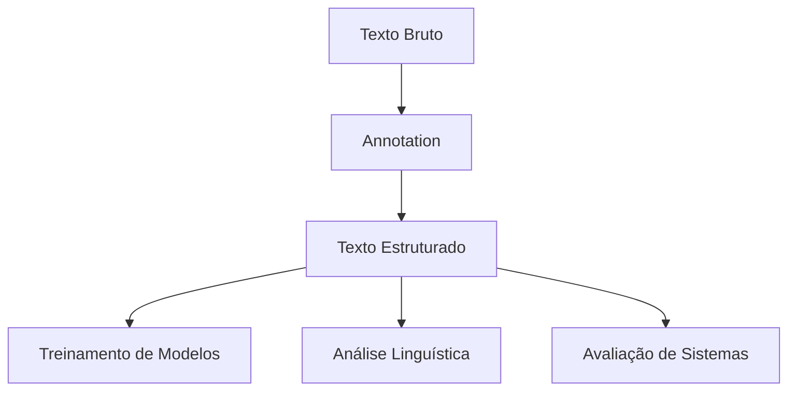
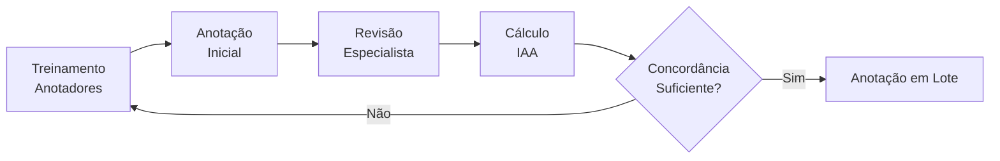

tags: #nlp #annotation #linguistics #data-labeling #machine-learning

# 🪶 Annotation: Fundamentos e Aplicações

> [!abstract] Definição
> **Annotation** é o processo de **rotular partes do texto** com informações semânticas, sintáticas ou contextuais. É a base para treinar e avaliar modelos de NLP supervisionados.

## 🎯 O Que é Annotation?

### Definição Expandida

> [!definition] Anotação Linguística
> Processo sistemático de **adicionar metadados** linguísticos a um texto, incluindo:
> - **Categorias gramaticais** (POS tags)
> - **Estruturas sintáticas** (árvores de parsing)
> - **Relações semânticas** (entidades, relações)
> - **Informações discursivas** (coreferência, sentimento)



## 📝 Tipos de Annotation

### 1. Annotation Sintática

> [!example] Estrutura Gramatical
> ```python
> # Exemplo: Constituency Parsing
> sentence = "The cat sat on the mat"
> parse_tree = """
> (S
>   (NP (DT The) (NN cat))
>   (VP (VBD sat)
>     (PP (IN on)
>       (NP (DT the) (NN mat))))
> )
> """
> ```

**Tipos Comuns:**
- **POS Tagging**: `The/DT cat/NN sat/VBD`
- **Dependency Parsing**: `nsubj(sat-3, cat-2)`
- **Constituency Parsing**: Árvores sintáticas

### 2. Annotation Semântica

> [!info] Entidades Nomeadas (NER)
> ```text
> [Pessoa John Smith] works at [Organização Google] in 
> [Localização Mountain View] since [Tempo 2020].
> ```

**Categorias Semânticas:**
- **Entidades Nomeadas** (PESSOA, ORGANIZAÇÃO, LOCAL)
- **Relações Semânticas** (EMPREGADO_EM, LOCALIZADO_EM)
- **Papéis Temáticos** (AGENTE, PACIENTE, ALVO)

### 3. Annotation Pragmática e Discursiva

> [!note] Análise de Sentimento
> ```json
> {
>   "text": "I love this product! It's amazing.",
>   "sentiment": "positive",
>   "intensity": 0.9,
>   "target": "product"
> }
> ```

**Outros Tipos:**
- **Coreferência**: `[Maria]₁ said [she]₁ would come`
- **Anáfora/Catáfora**
- **Estrutura Tópica**
- **Atos de Fala**

## 🛠️ Metodologias de Annotation

### Guidelines de Annotation

> [!important] Princípios Fundamentais
> 1. **Consistência**: Mesmos critérios para casos similares
> 2. **Precisão**: Definições claras e não ambíguas
> 3. **Completude**: Cobrir todos os casos relevantes
> 4. **Documentação**: Guidelines detalhadas e exemplos

### Exemplo: Guidelines para NER

```markdown
# Guidelines para Entidades PESSOA

## ✅ INCLUIR:
- Nomes completos: "Maria Silva"
- Apelidos conhecidos: "Pelé"
- Títulos + Nomes: "Dr. Smith"

## ❌ EXCLUIR:
- Cargos sem nome: "o médico"
- Pronomes: "ele", "ela"
- Coletivos: "a equipe", "os funcionários"

## Casos Limite:
- Personagens fictícios: ✅ INCLUIR
- Nomes em citações: ✅ INCLUIR
```

## 🔧 Ferramentas de Annotation

### Comparativo de Ferramentas

| Ferramenta | Tipo | Open Source | Colaborativo |
|------------|------|-------------|--------------|
| **BRAT** | Web-based | ✅ | ✅ |
| **Prodigy** | Desktop/Web | ❌ | ✅ |
| **Label Studio** | Web-based | ✅ | ✅ |
| **Doccano** | Web-based | ✅ | ✅ |
| **Apache UIMA** | Framework | ✅ | ✅ |

### Exemplo: Configuração Label Studio

```xml
<View>
  <Labels name="ner" toName="text">
    <Label value="Pessoa" background="red"/>
    <Label value="Organização" background="blue"/>
    <Label value="Localização" background="green"/>
  </Labels>
  <Text name="text" value="$text"/>
</View>
```

## 📊 Qualidade e Avaliação

### Métricas de Qualidade

> [!success] Medidas de Concordância
> ```python
> # Coeficiente Kappa de Cohen
> def cohens_kappa(ann1, ann2):
>     agreement = sum(a == b for a, b in zip(ann1, ann2))
>     expected = calculate_expected_agreement(ann1, ann2)
>     kappa = (agreement - expected) / (1 - expected)
>     return kappa
> 
> # Exemplo: Kappa > 0.8 indica excelente concordância
> ```

**Métricas Importantes:**
- **Inter-Annotator Agreement** (IAA)
- **Precision/Recall** contra gold standard
- **F1-Score** para avaliação balanceada

### Pipeline de Controle de Qualidade



## 💼 Casos de Uso Reais

### 1. Chatbots e Assistentes

> [!example] Annotation para Intenções
> ```yaml
> text: "Quero agendar uma reunião amanhã"
> intent: agendar_reuniao
> entities:
>   - type: data
>     value: "amanhã"
>   - type: tipo_evento
>     value: "reunião"
> slots:
>   - data: ???
>   - horario: ???
> ```

### 2. Análise de Sentimento Financeiro

```json
{
  "text": "As ações da Apple subiram 5% após o lançamento do novo iPhone",
  "sentiment": "positive",
  "confidence": 0.85,
  "target_entity": "Apple",
  "financial_indicator": "stock_price"
}
```

### 3. Processamento Jurídico

> [!tip] Contract Analysis
> ```text
> [CLÁUSULA Pagamento]₁: O [PARTE Cliente]₂ pagará 
> [VALOR R$ 10.000,00]₃ em [PRAZO 30 dias]₄. 
> [CONDIÇÃO]₅: Mediante [ENTREGA do produto]₆.
> ```

## 🚀 Melhores Práticas

### Workflow Eficiente

```python
class AnnotationWorkflow:
    def __init__(self):
        self.steps = [
            "1. Definição do Projeto",
            "2. Criação de Guidelines",
            "3. Treinamento dos Anotadores",
            "4. Anotação Piloto",
            "5. Cálculo de IAA",
            "6. Anotação em Lote",
            "7. Revisão Contínua",
            "8. Consolidação Final"
        ]
    
    def validate_annotation(self, annotation, guidelines):
        # Validação automática de regras
        pass
```

### Dicas Práticas

> [!warning] Erros Comuns
> - Guidelines muito vagas ou complexas
> - Treinamento insuficiente dos anotadores
> - Falta de revisão e feedback contínuo
> - Não calcular concordância inter-anotador

> [!success] Boas Práticas
> - **Iteração**: Comece pequeno e expanda
> - **Exemplos**: Forneça muitos exemplos claros
> - **Feedback**: Revisão regular e construtiva
> - **Ferramentas**: Use ferramentas apropriadas

## 📈 Tendencias e Futuro

### Annotation Ativa

```python
# Exemplo: Active Learning
def active_learning_annotation(model, unlabeled_data, batch_size=100):
    # Seleciona exemplos mais informativos
    uncertainties = model.predict_uncertainty(unlabeled_data)
    most_uncertain = np.argsort(uncertainties)[-batch_size:]
    
    return unlabeled_data[most_uncertain]
```

### Técnicas Emergentes

> [!todo] Futuro da Annotation
> - **Weak Supervision**: Usar regras e heurísticas
> - **Semi-supervised Learning**: Poucos exemplos rotulados
> - **Cross-lingual Transfer**: Aproveitar anotações em outras línguas
> - **Auto-annotation**: Modelos gerando próprias anotações

---

> [!summary] Conclusão
> A annotation é **crucial** para NLP moderno:
> - Transforma **texto não estruturado** em **dados estruturados**
> - Permite **treinamento supervisionado** de modelos
> - Requer **rigor metodológico** e **controle de qualidade**
> - Está evoluindo com **técnicas semi-supervisionadas**

## 🔗 Links Relacionados

- [[NLP - POS Tagging (Part-of-Speech)]]]
- [[NLP - Introdução]]
- [[Data-Labeling-Platforms]]
