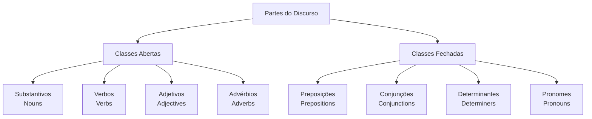
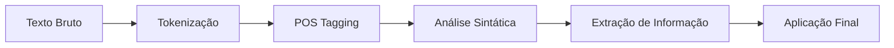

tags: #nlp #linguistics #pos-tagging #computational-linguistics

# Part-of-Speech Tagging: Da Teoria à Implementação

> [!abstract] Visão Geral
> POS Tagging é o processo de **rotular cada palavra em um texto** com sua categoria gramatical correspondente (substantivo, verbo, adjetivo, etc.). É uma tarefa fundamental no NLP que serve como base para muitas aplicações mais complexas.

## 🎯 Fundamentos Teóricos

### O Que São Partes do Discurso?

> [!definition] Parte do Discurso (POS)
> Categoria gramatical que classifica palavras baseando-se em:
> - **Função sintática**
> - **Significado léxico**
> - **Comportamento morfológico**

### Categorias Principais



### Tag Sets Populares

> [!example] Penn Treebank Tagset
> | Tag | Descrição | Exemplo |
> |-----|------------|---------|
> | NN | Substantivo singular | `cat` |
> | NNS | Substantivo plural | `cats` |
> | VB | Verbo base | `run` |
> | VBD | Verbo passado | `ran` |
> | JJ | Adjetivo | `beautiful` |
> | RB | Advérbio | `quickly` |

## 🛠️ Abordagens para POS Tagging

### 1. Abordagem Baseada em Regras

```python
# Exemplo simplificado de regras
def rule_based_pos_tag(word):
    rules = {
        'ing$': 'VBG',  # Gerúndio
        'ed$': 'VBD',   # Passado
        's$': 'NNS',    # Plural
        'ly$': 'RB',    # Advérbio
    }
    
    for pattern, tag in rules.items():
        if re.search(pattern, word):
            return tag
    return 'NN'  # Padrão
```

> [!note] Vantagens
> - Transparente e interpretável
> - Funciona bem para padrões regulares
> - Não requer dados de treinamento

### 2. Abordagem Estatística

> [!theory] Modelo de Markov Oculto (HMM)
> - **Estados ocultos**: Tags POS
> - **Observações**: Palavras
> - **Probabilidade de transição**: P(tag₂|tag₁)
> - **Probabilidade de emissão**: P(word|tag)

```python
# Pseudocódigo HMM
def hmm_viterbi(sentence, tags):
    # Inicialização
    for tag in tags:
        prob[tag] = initial_prob[tag] * emission_prob[word₁|tag]
    
    # Recursão
    for word in sentence[1:]:
        for tag in tags:
            prob[tag] = max(prev_prob[prev_tag] * 
                           transition_prob[tag|prev_tag] * 
                           emission_prob[word|tag])
    
    return best_sequence
```

### 3. Abordagem com Machine Learning

```python
from sklearn.feature_extraction import DictVectorizer
from sklearn.linear_model import Perceptron

# Features para treinamento
def extract_features(sentence, i):
    word = sentence[i]
    return {
        'word': word,
        'is_capitalized': word[0].isupper(),
        'prefix-1': word[:1],
        'prefix-2': word[:2],
        'prefix-3': word[:3],
        'suffix-1': word[-1:],
        'suffix-2': word[-2:],
        'suffix-3': word[-3:],
        'prev_word': '' if i == 0 else sentence[i-1],
        'next_word': '' if i == len(sentence)-1 else sentence[i+1],
    }
```

## 🚀 Abordagem com Deep Learning

### Arquitetura LSTM para POS Tagging

```python
import torch
import torch.nn as nn

class POSTagger(nn.Module):
    def __init__(self, vocab_size, tagset_size, embedding_dim=100, hidden_dim=128):
        super().__init__()
        self.embedding = nn.Embedding(vocab_size, embedding_dim)
        self.lstm = nn.LSTM(embedding_dim, hidden_dim, bidirectional=True)
        self.hidden2tag = nn.Linear(hidden_dim * 2, tagset_size)
    
    def forward(self, sentence):
        embeds = self.embedding(sentence)
        lstm_out, _ = self.lstm(embeds.view(len(sentence), 1, -1))
        tag_space = self.hidden2tag(lstm_out.view(len(sentence), -1))
        tag_scores = F.log_softmax(tag_space, dim=1)
        return tag_scores
```

> [!tip] Transformers Modernos
> Modelos como BERT e RoBERTa alcançam state-of-the-art usando:
> - **Attention mecanisms**
> - **Contexto bidirecional**
> - **Pré-treinamento em larga escala**

## 📊 Avaliação de Performance

### Métricas Principais

> [!info] Métricas de Avaliação
> ```python
> accuracy = (tags_corretos) / (total_tags)
> precision = TP / (TP + FP)
> recall = TP / (TP + FN)
> f1_score = 2 * (precision * recall) / (precision + recall)
> ```

### Desafios Comuns

> [!warning] Ambiguidade Léxica
> - **Bank**: substantivo (banco financeiro) ou verbo (inclinar)?
> - **Book**: substantivo (livro) ou verbo (reservar)?
> 
> **Solução**: Usar contexto para desambiguização

> [!warning] Palavras Desconhecidas
> - Neologismos
> - Erros de digitação
> - Termos técnicos
> 
> **Estratégias**: 
> - Análise morfológica
> - Fallback para regras
> - Embeddings subword

## 💡 Aplicações Práticas

### Pipeline de NLP



### Casos de Uso

> [!success] Aplicações
> - **Análise sintática** (parsing)
> - **Extração de informação**
> - **Tradução automática**
> - **Correção gramatical**
> - **Análise de sentimentos**
> - **Sistemas de perguntas e respostas**

## 🔧 Implementação Prática

### Exemplo com NLTK

```python
import nltk
from nltk import word_tokenize, pos_tag

text = "The quick brown fox jumps over the lazy dog"
tokens = word_tokenize(text)
tags = pos_tag(tokens)

print("POS Tags:", tags)
# Output: [('The', 'DT'), ('quick', 'JJ'), ('brown', 'JJ'), 
#          ('fox', 'NN'), ('jumps', 'VBZ'), ('over', 'IN'),
#          ('the', 'DT'), ('lazy', 'JJ'), ('dog', 'NN')]
```

### Exemplo com spaCy

```python
import spacy

nlp = spacy.load("en_core_web_sm")
doc = nlp("The quick brown fox jumps over the lazy dog")

for token in doc:
    print(f"{token.text:{12}} {token.pos_:{10}} {token.tag_:{8}} {spacy.explain(token.tag_)}")
```

---

> [!summary] Conclusão
> - POS Tagging é **fundamental** para pipelines de NLP
> - Evoluiu de **abordagens baseadas em regras** para **modelos neurais profundos**
> - A precisão moderna alcança **~97%** em inglês
> - Continua sendo um **campo ativo de pesquisa** para línguas com poucos recursos

## 📚 Referências

- [[Jurafsky-Martin-Speech-Language-Processing]]
- [[Manning-Schutze-Statistical-NLP]]
- [[spaCy-Documentation]]
- [[NLTK-Book]]
