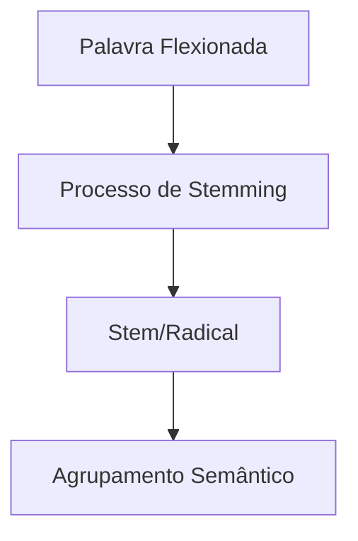
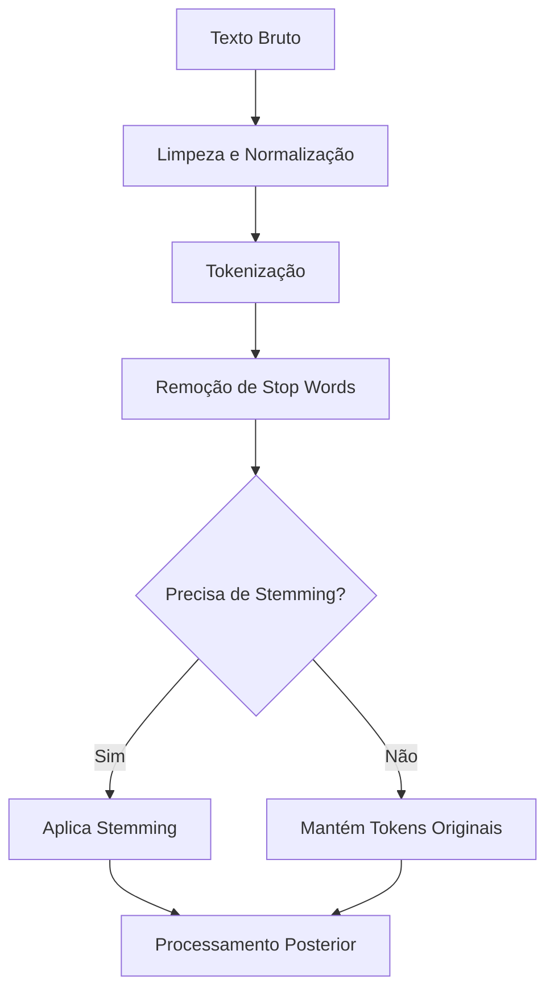

tags: [nlp, text-preprocessing, stemming, linguistics, natural-language-processing]

# 🌿 Stemming: Redução de Palavras ao Radical

> [!abstract] Definição
> **Stemming** é o processo de **reduzir palavras flexionadas** às suas formas radicais (stems) removendo afixos. É uma técnica fundamental no pré-processamento de texto para NLP.
[]()
## 🎯 O Que é Stemming?

### Conceito Fundamental

> [!definition] Stemming
> Algoritmo heurístico que **corta o final ou início das palavras** para obter uma forma comum baseada apenas na **estrutura morfológica**, não no significado léxico.


```mermaid
graph TB
    A[Palavra Flexionada] --> B[Processo de Stemming]
    B --> C[Stem/Radical]
    C --> D[Agrupamento Semântico]
```

### Stemming vs Lematização

> [!example] Comparação
> | Técnica | Abordagem | Exemplo | Resultado |
> |---------|-----------|---------|-----------|
> | **Stemming** | Heurística morfológica | "correndo", "correu", "corredor" | `corr` |
> | **Lematização** | Análise linguística | "correndo", "correu", "corredor" | `correr` |

## 📚 Algoritmos de Stemming

### 1. Porter Stemmer (Inglês)

#### Regras do Algoritmo Porter

> [!theory] Abordagem por Regras
> O Porter Stemmer aplica **sequências de regras** para remover sufixos em etapas:
> - **Step 1a**: SSES → SS, IES → I, SS → SS, S → ∅
> - **Step 1b**: (m>0) EED → EE, (*v*) ED → ∅, (*v*) ING → ∅
> - **Step 2**: (m>0) ATIONAL → ATE, (m>0) TIONAL → TION
> - E assim por diante...

```python
class PorterStemmer:
    def __init__(self):
        self.vowels = 'aeiou'
    
    def is_consonant(self, word, i):
        """Verifica se caractere na posição i é consoante"""
        if word[i] in self.vowels:
            return False
        if word[i] == 'y' and i > 0 and self.is_consonant(word, i-1):
            return False
        return True
    
    def measure(self, word):
        """Calcula a medida m (número de sequências VC)"""
        m = 0
        i = 0
        n = len(word)
        
        # Padrão: [C]VCVC...[V]
        while i < n:
            if self.is_consonant(word, i):
                # Encontra próxima vogal
                while i < n and self.is_consonant(word, i):
                    i += 1
                if i < n:
                    m += 1
                    # Encontra próxima consoante
                    while i < n and not self.is_consonant(word, i):
                        i += 1
            else:
                i += 1
        return m
    
    def step1a(self, word):
        """Step 1a do Porter Stemmer"""
        if word.endswith('sses'):
            return word[:-2]  # ssess -> ss
        elif word.endswith('ies'):
            return word[:-2]  # ies -> i
        elif word.endswith('ss'):
            return word
        elif word.endswith('s'):
            return word[:-1]
        return word

# Exemplo simplificado
stemmer = PorterStemmer()
print(f"measure('trees'): {stemmer.measure('trees')}")
print(f"step1a('cats'): {stemmer.step1a('cats')}")
```

### 2. RSLP Stemmer (Português)

#### Especificidades do Português

> [!note] RSLP - Removedor de Sufixos da Língua Portuguesa
> Desenvolvido especificamente para português, lida com:
> - **Sufixos nominais**: -mente, -ção, -mente
> - **Sufixos verbais**: -ando, -endo, -indo
> - **Sufixos plurais**: -s, -es, -ões

```python
class RSLPStemmer:
    def __init__(self):
        self.suffixes = [
            # Ordem por tamanho (maiores primeiro)
            'abilidades', 'acional', 'ucional', 'amente', 'idades',
            'ância', 'ência', 'mente', 'idade', 'ância', 'ência',
            'eza', 'ezas', 'ico', 'ica', 'oso', 'osa',
            'amento', 'imento', 'adora', 'ador', 'ação',
            'antes', 'ância', 'ável', 'ível', 'ista', 'ivo',
            'ada', 'ido', 'iva', 'ivo', 'ira', 'eiro',
            'ão', 'ês', 'ar', 'er', 'ir', 'as', 'es', 'is',
            'a', 'e', 'i', 'o', 'u'
        ]
    
    def stem(self, word):
        """Aplica stemming RSLP simplificado"""
        word_lower = word.lower()
        
        for suffix in self.suffixes:
            if word_lower.endswith(suffix):
                # Verifica se a palavra tem pelo menos 3 caracteres após remoção
                stemmed = word_lower[:-len(suffix)]
                if len(stemmed) >= 3:
                    return stemmed
        
        return word_lower

# Exemplo
rslp = RSLPStemmer()
palavras = ['correndo', 'felizmente', 'cantando', 'amável', 'computador']
for palavra in palavras:
    stem = rslp.stem(palavra)
    print(f"{palavra:12} → {stem}")
```

## 🛠️ Implementações Práticas

### Implementação com NLTK

```python
import nltk
from nltk.stem import PorterStemmer, SnowballStemmer
from nltk.tokenize import word_tokenize

# Download recursos se necessário
nltk.download('punkt')

# Stemmers disponíveis
porter = PorterStemmer()
snowball_pt = SnowballStemmer('portuguese')

def stem_text_nltk(text, language='portuguese'):
    """
    Aplica stemming em texto usando NLTK
    """
    tokens = word_tokenize(text, language='portuguese')
    
    if language == 'portuguese':
        stemmer = SnowballStemmer('portuguese')
    else:
        stemmer = PorterStemmer()
    
    stemmed_tokens = [stemmer.stem(token) for token in tokens]
    
    return ' '.join(stemmed_tokens)

# Exemplos
texto_pt = "Os gatos corriam rapidamente pelo jardim felizmente"
texto_en = "The cats were running quickly through the happy garden"

print("=== Stemming com NLTK ===")
print(f"Português: {stem_text_nltk(texto_pt)}")
print(f"Inglês: {stem_text_nltk(texto_en, 'english')}")
```

### Implementação com spaCy + Custom Stemmer

```python
import spacy
import re

class EnhancedPortugueseStemmer:
    def __init__(self):
        # Padrões regex para sufixos comuns em português
        self.patterns = [
            (r'(amentos|imentos)$', ''),      # substantivos
            (r'(ando|endo|indo)$', ''),       # gerúndio
            (r'(adas|idos|idas)$', ''),       # particípio
            (r'(ará|erá|irá)$', ''),         # futuro
            (r'(ava|ia)$', ''),              # pretérito imperfeito
            (r'(ões|ães|ais|eis)$', 'ão'),   # plurais
            (r'(mente)$', ''),               # advérbios
            (r'(íssimo|íssima)$', ''),       # superlativo
            (r'(zinhos|zinhas)$', ''),       # diminutivo
            (r'(íamo|íeis)$', 'ir'),         # verbos
        ]
        
    def stem(self, word):
        original = word.lower()
        
        # Aplica padrões na ordem
        for pattern, replacement in self.patterns:
            stemmed = re.sub(pattern, replacement, original)
            if stemmed != original:
                # Verifica se stem tem comprimento mínimo
                if len(stemmed) >= 2:
                    return stemmed
        
        return original

# Uso do stemmer avançado
enhanced_stemmer = EnhancedPortugueseStemmer()
test_words = [
    'correndo', 'felizmente', 'cantarão', 'amávamos', 
    'gatinhos', 'lindíssima', 'computadores'
]

print("=== Stemming Avançado ===")
for word in test_words:
    stem = enhanced_stemmer.stem(word)
    print(f"{word:15} → {stem}")
```

## 📊 Análise de Resultados

### Comparação de Algoritmos

```python
def compare_stemmers(words):
    """
    Compara diferentes algoritmos de stemming
    """
    porter = PorterStemmer()
    snowball_pt = SnowballStemmer('portuguese')
    snowball_es = SnowballStemmer('spanish')
    custom_pt = EnhancedPortugueseStemmer()
    
    print(f"{'Palavra':15} {'Porter':10} {'Snowball PT':12} {'Snowball ES':12} {'Custom PT':12}")
    print("-" * 70)
    
    for word in words:
        results = [
            porter.stem(word),
            snowball_pt.stem(word),
            snowball_es.stem(word),
            custom_pt.stem(word)
        ]
        print(f"{word:15} {results[0]:10} {results[1]:12} {results[2]:12} {results[3]:12}")

# Teste comparativo
test_words = ['running', 'correndo', 'happiness', 'felicidade', 'computadores']
compare_stemmers(test_words)
```

### Visualização do Processo

```python
import matplotlib.pyplot as plt

def visualize_stemming_examples():
    """
    Visualiza exemplos de stemming
    """
    stemmer_pt = SnowballStemmer('portuguese')
    
    examples = {
        'Verbos': ['correr', 'correndo', 'correu', 'correrão'],
        'Substantivos': ['casa', 'casas', 'casinha', 'casebre'],
        'Adjetivos': ['feliz', 'felizmente', 'felicidade', 'infeliz'],
        'Advérbios': ['rápido', 'rapidamente', 'rápidos', 'rapidez']
    }
    
    fig, axes = plt.subplots(2, 2, figsize=(12, 10))
    axes = axes.flatten()
    
    for idx, (category, words) in enumerate(examples.items()):
        stems = [stemmer_pt.stem(word) for word in words]
        
        # Plot
        x_pos = range(len(words))
        axes[idx].bar(x_pos, [1] * len(words), alpha=0.7, label='Original')
        axes[idx].set_xticks(x_pos)
        axes[idx].set_xticklabels(words, rotation=45)
        axes[idx].set_title(f'{category} - Stemming')
        axes[idx].grid(True, alpha=0.3)
        
        # Adiciona stems como texto
        for i, (word, stem) in enumerate(zip(words, stems)):
            axes[idx].text(i, 0.5, stem, ha='center', va='center', 
                          fontweight='bold', color='red')
    
    plt.tight_layout()
    plt.show()

visualize_stemming_examples()
```

## 🎯 Aplicações Práticas

### Sistema de Busca com Stemming

```python
class SearchEngineWithStemming:
    def __init__(self, documents):
        self.documents = documents
        self.stemmer = SnowballStemmer('portuguese')
        self.stemmed_index = self._build_index()
    
    def _build_index(self):
        """
        Constrói índice invertido com stems
        """
        index = {}
        for doc_id, document in enumerate(self.documents):
            tokens = word_tokenize(document.lower())
            stems = [self.stemmer.stem(token) for token in tokens 
                    if token.isalpha()]  # Remove pontuação
            
            for stem in set(stems):  # Usa set para evitar duplicatas
                if stem not in index:
                    index[stem] = []
                index[stem].append(doc_id)
        
        return index
    
    def search(self, query):
        """
        Busca documentos relevantes usando stemming
        """
        query_tokens = word_tokenize(query.lower())
        query_stems = [self.stemmer.stem(token) for token in query_tokens 
                      if token.isalpha()]
        
        # Encontra documentos relevantes
        relevant_docs = set()
        for stem in query_stems:
            if stem in self.stemmed_index:
                relevant_docs.update(self.stemmed_index[stem])
        
        return [self.documents[doc_id] for doc_id in relevant_docs]

# Exemplo de uso
documents = [
    "Os gatos estão correndo no jardim",
    "O cachorro corre rapidamente",
    "Gatos e cachorros são animais domésticos",
    "O jardim tem flores bonitas"
]

engine = SearchEngineWithStemming(documents)
results = engine.search("gato correndo")

print("=== Resultados da Busca ===")
for result in results:
    print(f"- {result}")
```

### Pré-processamento para Machine Learning

```python
from sklearn.feature_extraction.text import TfidfVectorizer
from sklearn.pipeline import Pipeline
from sklearn.base import BaseEstimator, TransformerMixin

class StemmingTransformer(BaseEstimator, TransformerMixin):
    def __init__(self, language='portuguese'):
        self.language = language
        self.stemmer = SnowballStemmer(language)
    
    def fit(self, X, y=None):
        return self
    
    def transform(self, X):
        """
        Aplica stemming em uma lista de textos
        """
        stemmed_texts = []
        for text in X:
            tokens = word_tokenize(text.lower())
            stems = [self.stemmer.stem(token) for token in tokens 
                    if token.isalpha()]
            stemmed_texts.append(' '.join(stems))
        
        return stemmed_texts

# Pipeline completo com stemming
def create_stemming_pipeline():
    return Pipeline([
        ('stemming', StemmingTransformer()),
        ('tfidf', TfidfVectorizer(max_features=1000)),
    ])

# Exemplo
texts = [
    "Estou aprendendo processamento de linguagem natural",
    "O processamento de texto é importante para NLP",
    "Stemming é uma técnica de pré-processamento",
    "Reduzir palavras aos seus radicais melhora resultados"
]

pipeline = create_stemming_pipeline()
X_transformed = pipeline.fit_transform(texts)

print("Dimensões da matriz TF-IDF:", X_transformed.shape)
print("Feature names:", pipeline.named_steps['tfidf'].get_feature_names_out()[:10])
```

## 📈 Avaliação de Desempenho

### Métricas de Qualidade

```python
def evaluate_stemmer_quality(stemmer, word_groups):
    """
    Avalia a qualidade do stemmer usando grupos de palavras relacionadas
    """
    total_groups = len(word_groups)
    correct_groups = 0
    
    for group in word_groups:
        stems = [stemmer.stem(word) for word in group]
        # Considera correto se todas as palavras do grupo têm o mesmo stem
        if len(set(stems)) == 1:
            correct_groups += 1
    
    accuracy = correct_groups / total_groups
    return accuracy

# Grupos de teste
test_groups = [
    ['correr', 'correndo', 'correu', 'correrá'],
    ['feliz', 'felizmente', 'felicidade'],
    ['casa', 'casas', 'casinha'],
    ['computador', 'computadores', 'computação']
]

stemmer_pt = SnowballStemmer('portuguese')
accuracy = evaluate_stemmer_quality(stemmer_pt, test_groups)

print(f"Acurácia do Stemmer: {accuracy:.1%}")
```

### Análise de Overstemming e Understemming

> [!important] Problemas Comuns
> 
> **Overstemming**: Palavras diferentes reduzidas ao mesmo stem
> ```python
> # Exemplo: "universal" e "universidade" → "univers"
> overstemming_examples = [
>     ('universal', 'universidade'),
>     ('argumento', 'argumentação'),
>     ('real', 'realidade')
> ]
> ```
> 
> **Understemming**: Palavras relacionadas não reduzidas ao mesmo stem
> ```python
> # Exemplo: "correr" e "corrida" → stems diferentes
> understemming_examples = [
>     ('correr', 'corrida'),
>     ('cantar', 'canto'),
>     ('andar', 'andamento')
> ]
> ```

```python
def analyze_stemming_errors(stemmer, word_pairs):
    """
    Analisa overstemming e understemming
    """
    overstemming_count = 0
    understemming_count = 0
    
    for word1, word2 in word_pairs:
        stem1 = stemmer.stem(word1)
        stem2 = stemmer.stem(word2)
        
        # São palavras semanticamente relacionadas?
        are_related = True  # Em prática, usar dicionário semântico
        
        if stem1 == stem2 and not are_related:
            overstemming_count += 1
            print(f"OVERSTEMMING: '{word1}' → '{stem1}', '{word2}' → '{stem2}'")
        elif stem1 != stem2 and are_related:
            understemming_count += 1
            print(f"UNDERSTEMMING: '{word1}' → '{stem1}', '{word2}' → '{stem2}'")
    
    print(f"\nOverstemming: {overstemming_count}")
    print(f"Understemming: {understemming_count}")

# Teste
test_pairs = [('universal', 'universidade'), ('correr', 'corrida')]
analyze_stemming_errors(stemmer_pt, test_pairs)
```

## 🚀 Melhores Práticas

### Quando Usar Stemming

> [!success] Casos de Uso Ideais
> - **Sistemas de busca** e information retrieval
> - **Análise de texto** para mineração de opinião
> - **Classificação de documentos**
> - **Detecção de plágio**
> - **Análise de similaridade** textual

### Quando Evitar Stemming

> [!warning] Limitações
> - **Aplicações que precisam de significado preciso**
> - **Processamento sintático** complexo
> - **Lematização** é preferível quando disponível
> - **Línguas com morfologia complexa**

### Pipeline Recomendado


```mermaid
graph TD
    A[Texto Bruto] --> B[Limpeza e Normalização]
    B --> C[Tokenização]
    C --> D[Remoção de Stop Words]
    D --> E{Precisa de Stemming?}
    E -->|Sim| F[Aplica Stemming]
    E -->|Não| G[Mantém Tokens Originais]
    F --> H[Processamento Posterior]
    G --> H
```

---

> [!summary] Conclusão
> **Stemming** é uma técnica poderosa mas com limitações:
> - **Reduz dimensionalidade** e **melhora recall**
> - **Heurístico** → pode cometer erros
> - **Específico por idioma** → escolha o algoritmo correto
> - **Complementar** a outras técnicas de NLP
