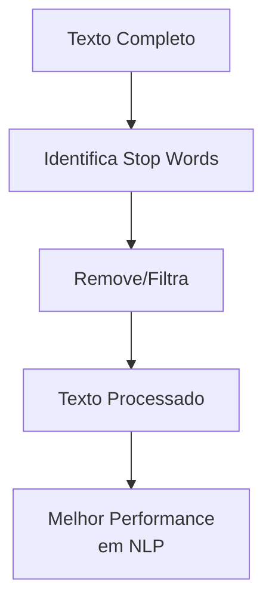
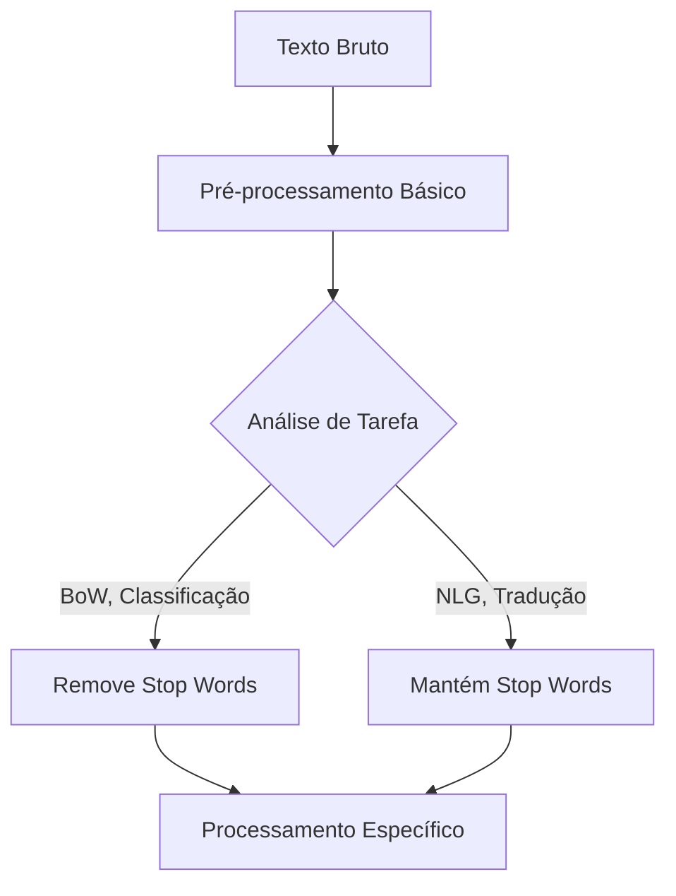

tags: [nlp, preprocessing, stop-words, text-mining, feature-engineering]

# 🛑 Stop Words: Fundamentos e Aplicações

> [!abstract] Definição
> **Stop Words** são palavras extremamente comuns que são **filtradas** durante o processamento de texto por carregarem **pouco valor semântico**. São consideradas "ruído" em muitas tarefas de NLP.

## 🎯 O Que São Stop Words?

### Definição Expandida

> [!definition] Stop Words
> Palavras funcionais que aparecem com **alta frequência** em um idioma mas contribuem **pouco para o significado** do texto. Incluem:
> - **Artigos**: o, a, os, as
> - **Preposições**: de, em, para, por
> - **Conjunções**: e, ou, mas, se
> - **Pronomes**: eu, tu, ele, nós
> - **Outras**: muito, já, também, apenas



## 📊 Por Que Remover Stop Words?

### Vantagens

> [!success] Benefícios
> ```python
> # Antes: "o gato pulou sobre o muro alto"
# Depois: "gato pulou muro alto"
# Redução de 7 para 4 tokens (43% menos)

**Vantagens Principais:**
- **Redução de dimensionalidade**
- **Melhora performance** de algoritmos
- **Foco no conteúdo** semântico
- **Processamento mais rápido**
- **Menos ruído** para modelos

### Desvantagens

> [!warning] Quando NÃO Remover
> - **Tarefas de linguagem natural**: tradução, geração
> - **Análise de estilo/autoría**
> - **Processamento de consultas** em search
> - **Tarefas dependentes de contexto completo**

## 🗂️ Listas de Stop Words por Idioma

### Comparativo entre Idiomas

| Idioma | Exemplos | Tamanho Típico |
|--------|----------|----------------|
| **Português** | o, a, os, as, de, em, para | 200-400 |
| **Inglês** | the, a, an, in, on, at, and | 150-300 |
| **Espanhol** | el, la, los, las, de, en | 200-350 |
| **Francês** | le, la, les, de, en, à | 250-400 |

### Exemplo: Lista em Português

```python
# Stop Words comuns em português
PORTUGUESE_STOP_WORDS = {
    'o', 'a', 'os', 'as', 'um', 'uma', 'uns', 'umas',
    'de', 'do', 'da', 'dos', 'das', 'em', 'no', 'na', 
    'nos', 'nas', 'por', 'para', 'com', 'sem', 'sob',
    'sobre', 'entre', 'até', 'após', 'desde', 'e', 'ou',
    'mas', 'porém', 'contudo', 'entretanto', 'se', 'porque',
    'que', 'qual', 'quais', 'quem', 'cujo', 'cuja',
    'eu', 'tu', 'ele', 'ela', 'nós', 'vós', 'eles', 'elas',
    'meu', 'minha', 'teu', 'tua', 'seu', 'sua', 'nosso',
    'muito', 'pouco', 'já', 'ainda', 'sempre', 'nunca',
    'também', 'apenas', 'etc', 'à', 'às', 'ao', 'aos'
}
```

## 🛠️ Implementação Prática

### Método Básico com NLTK

```python
import nltk
from nltk.corpus import stopwords
from nltk.tokenize import word_tokenize

# Download recursos (se necessário)
nltk.download('stopwords')
nltk.download('punkt')

def remove_stopwords_nltk(text, language='portuguese'):
    # Tokenização
    tokens = word_tokenize(text, language='portuguese')
    
    # Carrega stop words
    stop_words = set(stopwords.words(language))
    
    # Filtra tokens
    filtered_tokens = [
        token for token in tokens 
        if token.lower() not in stop_words and token.isalpha()
    ]
    
    return filtered_tokens

# Exemplo
texto = "O gato pulou sobre o muro e correu para o jardim."
resultado = remove_stopwords_nltk(texto)
print(resultado)  # ['gato', 'pulou', 'muro', 'correu', 'jardim']
```

### Método com spaCy

```python
import spacy

# Carrega modelo em português
nlp = spacy.load("pt_core_news_sm")

def remove_stopwords_spacy(text):
    doc = nlp(text)
    
    filtered_tokens = [
        token.text for token in doc 
        if not token.is_stop and not token.is_punct
    ]
    
    return filtered_tokens

# Exemplo
texto = "A empresa anunciou novos produtos para o mercado."
resultado = remove_stopwords_spacy(texto)
print(resultado)  # ['empresa', 'anunciou', 'novos', 'produtos', 'mercado']
```

### Implementação Customizada

```python
class CustomStopWords:
    def __init__(self, language='portuguese'):
        self.base_stopwords = set(stopwords.words(language))
        self.custom_stopwords = set()
        self.keep_words = set()
    
    def add_stopwords(self, words):
        """Adiciona palavras personalizadas à lista"""
        if isinstance(words, str):
            words = [words]
        self.custom_stopwords.update(words)
    
    def remove_stopwords(self, words):
        """Remove palavras da lista de stop words"""
        if isinstance(words, str):
            words = [words]
        self.keep_words.update(words)
    
    def filter_text(self, tokens):
        """Filtra tokens usando lista combinada"""
        all_stopwords = (self.base_stopwords | self.custom_stopwords) - self.keep_words
        
        return [
            token for token in tokens 
            if token.lower() not in all_stopwords
        ]

# Uso
custom_filter = CustomStopWords()
custom_filter.add_stopwords(['produto', 'serviço'])  # Domínio específico
custom_filter.remove_stopwords('mas')  # Mantém 'mas' para análise de contraste

tokens = ['este', 'produto', 'mas', 'serviço', 'excelente']
filtrado = custom_filter.filter_text(tokens)
print(filtrado)  # ['mas', 'excelente']
```

## 📈 Análise de Impacto

### Antes e Depois da Remoção

> [!example] Comparação Visual
> ```python
> texto_original = "O algoritmo de machine learning não deve ser aplicado sem uma análise cuidadosa dos dados."
> 
> # Com stop words
> tokens_com_stop = word_tokenize(texto_original)  # 14 tokens
> 
> # Sem stop words  
> tokens_sem_stop = remove_stopwords_nltk(texto_original)  # 7 tokens
> 
> print("Redução:", f"{(14-7)/14*100:.1f}%")
> # Redução: 50.0%
> ```

### Efeito em TF-IDF

```python
from sklearn.feature_extraction.text import TfidfVectorizer

corpus = [
    "o gato está sobre o tapete",
    "o cachorro corre no jardim",
    "o gato e o cachorro são animais"
]

# Com stop words
vectorizer_com = TfidfVectorizer()
tfidf_com = vectorizer_com.fit_transform(corpus)

# Sem stop words  
vectorizer_sem = TfidfVectorizer(stop_words='english')
tfidf_sem = vectorizer_sem.fit_transform(corpus)

print("Dimensões com stop words:", tfidf_com.shape)
print("Dimensões sem stop words:", tfidf_sem.shape)
# Com: (3, 11), Sem: (3, 8) - Redução de 27%
```

## 🎯 Quando Usar e Quando Não Usar

### Tarefas que Beneficiam

> [!tip] Remover Stop Words é Útil Para:
> - **Bag-of-Words models**
> - **Topic Modeling** (LDA, NMF)
> - **Text Classification**
> - **Information Retrieval**
> - **Word Embeddings** (Word2Vec, GloVe)
> - **Similaridade de Texto**

### Tarefas que Prejudicam

> [!warning] Evitar Remoção Em:
> - **Machine Translation**
> - **Text Generation**
> - **Sentiment Analysis** (às vezes)
> - **Language Modeling**
> - **Grammar Checking**
> - **Question Answering**

## 🔧 Técnicas Avançadas

### Stop Words Dinâmicas

```python
import pandas as pd
from collections import Counter

def dynamic_stopwords(corpus, threshold_percent=0.8):
    """
    Identifica stop words baseado na frequência no corpus
    """
    all_tokens = []
    for doc in corpus:
        tokens = word_tokenize(doc.lower())
        all_tokens.extend(tokens)
    
    # Calcula frequência
    token_freq = Counter(all_tokens)
    total_docs = len(corpus)
    
    # Tokens que aparecem em mais de X% dos documentos
    dynamic_stops = {
        token for token, freq in token_freq.items()
        if freq / total_docs > threshold_percent
    }
    
    return dynamic_stops

# Exemplo
corpus = [
    "o sistema precisa de manutenção",
    "o usuário reportou um problema", 
    "o administrador configurou o sistema"
]

stops_dinamicas = dynamic_stopwords(corpus, 0.6)
print(stops_dinamicas)  # {'o'} (aparece em 100% dos documentos)
```

### Stop Words por Domínio

> [!note] Domínio Específico
> ```python
> # Em domínio médico
> MEDICAL_STOP_WORDS = {
>     'paciente', 'tratamento', 'diagnóstico', 'sintoma',
>     'medicamento', 'hospital', 'consulta'
> }
> 
> # Em domínio jurídico  
> LEGAL_STOP_WORDS = {
>     'artigo', 'parágrafo', 'cláusula', 'contrato',
>     'lei', 'decreto', 'processo'
> }
> ```

## 📊 Benchmarks e Performance

### Comparação de Velocidade

```python
import time

def benchmark_stopword_removal(texts, method):
    start_time = time.time()
    
    for text in texts:
        method(text)
    
    end_time = time.time()
    return end_time - start_time

# Teste com diferentes métodos
texts = ["Texto de exemplo com várias stop words"] * 1000

time_nltk = benchmark_stopword_removal(texts, remove_stopwords_nltk)
time_spacy = benchmark_stopword_removal(texts, remove_stopwords_spacy)

print(f"NLTK: {time_nltk:.2f}s")
print(f"spaCy: {time_spacy:.2f}s")
```

## 🚀 Melhores Práticas

### Guidelines de Uso

> [!important] Recomendações
> 1. **Comece simples**: Use listas padrão primeiro
> 2. **Avalie o impacto**: Compare com/sem stop words
> 3. **Customize conforme domínio**: Adicione/remova palavras
> 4. **Documente as escolhas**: Mantenha registro das decisões
> 5. **Considere o contexto**: Nem sempre remover é melhor

### Pipeline Recomendado



---

> [!summary] Conclusão
> Stop Words são uma ferramenta **poderosa** no pré-processamento de texto:
> - **Reduzem dimensionalidade** e **melhoram performance**
> - São **dependentes de domínio** e **tarefa**
> - Devem ser **usadas com critério**
> - **Customização** geralmente produz melhores resultados
