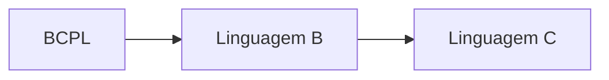
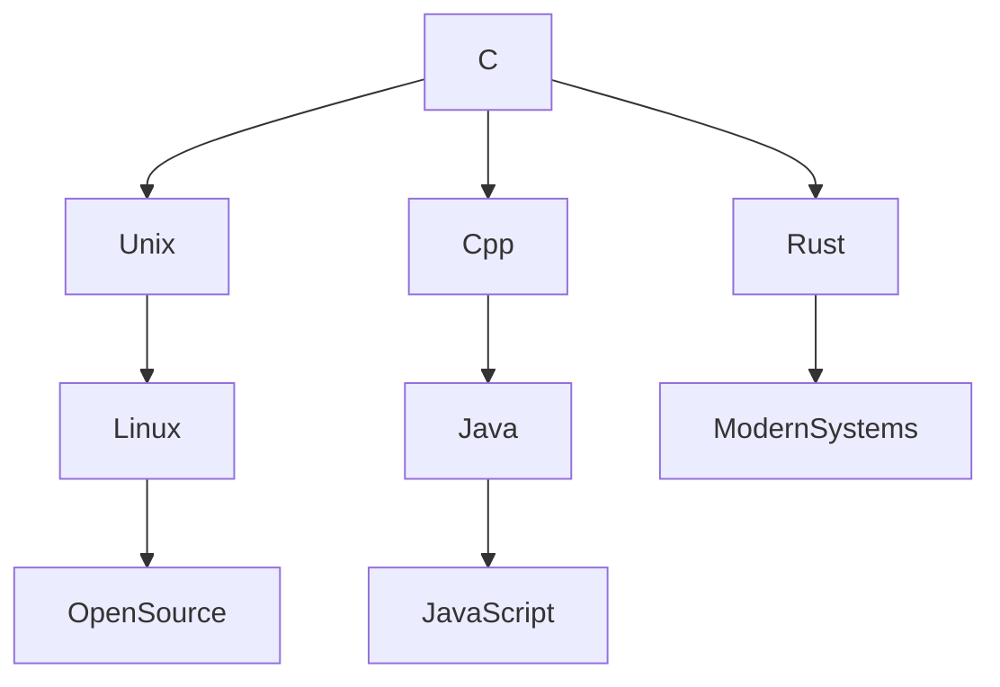

## 🗓️ Origem

> [!info] Contexto Histórico
> - **Data:** 1972
> - **Local:** Bell Labs (AT&T), EUA
> - **Criador:** Dennis Ritchie

## 🔄 Linha do Tempo Evolutiva



> [!note] Antecessores
> - **BCPL** → **Linguagem B** (Ken Thompson, 1969) → **Linguagem C**
> - **Motivação:** Reescrever o sistema Unix, originalmente em Assembly

## 💡 Momento Revolucionário

> [!success] Marco Histórico
> - **1973:** Kernel do Unix reescrito em C
> - **Prova conceitual:** Linguagens de alto nível PODEM ser usadas para programação de sistemas
> - **Impacto:** Revolucionou o desenvolvimento de sistemas operacionais

## 📚 Padronização da Linguagem

### 📖 K&R C (1978)
> [!quote] "The C Programming Language" - Brian Kernighan & Dennis Ritchie
> - Primeira especificação amplamente reconhecida
> - Conhecida como "C tradicional"

### 🏷️ Padrões Oficiais

> [!abstract] Linha do Tempo dos Padrões
> ```mermaid
> timeline
>     title Evolução dos Padrões C
>     1978 : K&R C
>     1989 : ANSI C (C89)
>     1990 : ISO C (C90)
>     1999 : C99
>     2011 : C11
>     2017 : C17/C18
>     2023 : C23
> ```

> [!seealso] Principais Características por Versão
> - **C89/C90:** Primeiro padrão formal, `void`, `enum`
> - **C99:** `// comentários`, `long long`, `bool`, VLAs
> - **C11:** Concorrência, melhorias de segurança
> - **C17/C18:** Correções de bugs
> - **C23:** Padrão mais recente

## 🌍 Influência & Legado

> [!tip] Impacto no Ecossistema
> **Linguagens Derivadas:**
> - C++ → C# → Java
> - Objective-C → Swift
> - Rust, Go, D
> 
> **Domínios de Atuação:**
> - Sistemas Operacionais
> - Compiladores
> - Sistemas Embarcados
> - Desenvolvimento de Drivers

> [!quote] Filosofia
> "Trust the programmer" - Oferece poder com responsabilidade

---

## 🔗 Conexões Importantes

### 💻 Cadeia de Influência


### 🔄 Relação com Outras Tecnologias
- **C → Unix/Linux → Open Source:** Portabilidade do C permitiu disseminação do Unix
- **C → C++:** Bjarne Stroustrup adicionou OOP ao C
- **Assembly → C:** "Assembly portável" - abstrai hardware mantendo controle

## 🏷️ Tags & Categorias

#LinguagemC #HistoriaComputacao 
#DennisRitchie #BellLabs #Unix 
#ProgramacaoSistemas #ANSI_C 
#Padronizacao #EvolucaoLinguagens
#C89 #C99 #C11 #C23

## 📌 Notas Adicionais

> [!warning] Curiosidade
> A linguagem C permanece relevante após 50+ anos, sendo fundamental para:
> - Educação em ciência da computação
> - Desenvolvimento de sistemas críticos
> - Manutenção de legado corporativo
> - Projetos de alta performance

**Próximos tópicos para explorar:**
- [[C - Ambiente de Desenvolvimento]]

---
