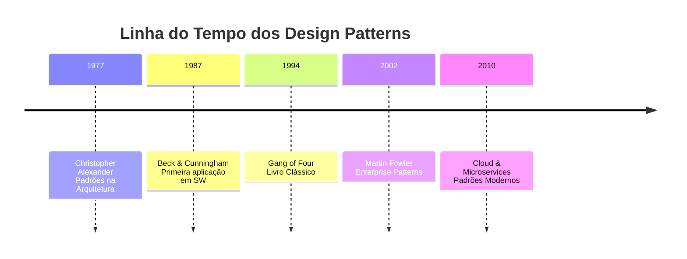

> [!INFO] Definição Rápida
> **Padrões de projeto** são **soluções reutilizáveis** para problemas comuns de design de software. São como "receitas testadas" pela comunidade de desenvolvimento.



> [!NOTE]- 🏗️ Origens na Arquitetura (1977)
> A história começa com **Christopher Alexander** e seu livro "*A Pattern Language*", onde aplicou padrões à arquitetura física antes da computação.

> [!TIP]- 💻 Chegam à Computação (1987-1990)
> **Kent Beck & Ward Cunningham** aplicaram pela primeira vez os conceitos de Alexander ao desenvolvimento de software.

> [!IMPORTANT]- 👑 Era Gang of Four (1994)
> O marco histórico: **Erich Gamma, Richard Helm, Ralph Johnson e John Vlissides** publicaram o livro que catalogou 23 padrões fundamentais.

> [!EXAMPLE]- 🌊 Expansão (1995-2005)
> Período de especialização com padrões enterprise, segurança, jogos e cloud.

> [!SUCCESS]- ☁️ Era Moderna (2005-Presente)
> Surgem padrões para microservices, cloud native, serverless e reactive programming.

## 📚 Catálogo de Padrões GoF
Boa, Rapha! Bora fazer um **resumão dos 23 padrões de projeto (GoF)** no mesmo estilo que você montou.

> [!ABSTRACT]- 🎭 **Padrões Criacionais**
> 
> |Pattern|Problema|Solução|💡 Uso Prático|
> |---|---|---|---|
> |[[Singleton]]|Garantir instância única|Construtor privado + acesso global|Logger, Config, Cache|
> |[[Factory Method]]|Criação dependente de subclasses|Delegar para método fábrica|DI Containers, Plugins|
> |[[Factory Method]]|Forte acoplamento entre famílias de objetos|Interface que cria famílias de objetos|UI cross-platform, DB Drivers|
> |[[Builder]]|Construtores com muitos parâmetros|Construção passo-a-passo|Queries SQL, Objetos complexos|
> |[[Prototype]]|Criação custosa de objetos|Clonagem de instâncias existentes|Jogos (NPCs), Cache de objetos|

> [!ABSTRACT]- 🏛️ **Padrões Estruturais**
> 
> |Pattern|🎨 Analogia|🚀 Melhor Para|
> |---|---|---|
> |[[Adapter]]|Adaptador de tomada|Integrar APIs legadas|
> |[[Bridge]]|Controle remoto/TV|Separar abstração da implementação|
> |[[Composite]]|Árvore de pastas|Estruturas hierárquicas|
> |[[Decorator]]|Embrulho de presente|Extensibilidade sem herança|
> |[[Facade]]|Recepcionista de hotel|Simplificar sistemas complexos|
> |[[Flyweight]]|Tipos de peça em xadrez|Otimizar uso de memória|
> |[[Proxy]]|Cópia/representante|Controle de acesso, lazy loading|

> [!ABSTRACT]- 🧠 **Padrões Comportamentais**
> 
> |Pattern|🎯 Conceito|💼 Caso Real|
> |---|---|---|
> |[[Chain of Responsibility]]|Passar requisição até alguém tratar|Middleware, Handlers|
> |[[Command]]|Encapsular ações|Undo/Redo, Filas de tarefas|
> |[[Interpreter]]|Linguagem em miniatura|Regex, Query engines|
> |[[Iterator]]|Acessar itens sequenciais|Coleções, Streams|
> |[[Mediator]]|Torre de controle|Chatrooms, UI Components|
> |[[Memento]]|Tirar snapshot|Save/Restore de estado|
> |[[Observer]]|Pub/Sub|Event-driven, GUIs|
> |[[State]]|Máquina de estados|Workflow, Autômatos|
> |[[Strategy]]|Troca de algoritmos|Payment methods, Compressão|
> |[[Template Method]]|Esqueleto de algoritmo|Frameworks, Hooks|
> |[[Visitor]]|Separar operação da estrutura|AST traversal, Compiladores|

## 🎯 Quando Usar?

> [!SUCCESS]- ✅ **Use Quando**
> - Problema **recorrente**
> - **Manutenibilidade** importante
> - Time **distribuído**
> - Projeto **longo prazo**

> [!WARNING]- ❌ **Evite Quando**  
> - **Over-engineering**
> - Projetos **simples**
> - **Performance** crítica
> - Time **pequeno**

## 🎨 Visualizações Interativas

> [!NOTE]- Fluxo Observer Pattern
> ```mermaid
> flowchart TD
>     A[Subject] --> B[Observer 1]
>     A --> C[Observer 2]
>     A --> D[Observer 3]
>     style A fill:#ff6b6b
>     style B fill:#4ecdc4
>     style C fill:#4ecdc4
>     style D fill:#4ecdc4
> ```

> [!TIP]- Comparação Criacionais
> ```mermaid
> quadrantChart
>     title Complexidade vs Flexibilidade
>     x-axis Baixa --> Alta
>     y-axis Pouca --> Muita
>     Singleton: [0.1, 0.1]
>     Factory: [0.3, 0.4]
>     Builder: [0.7, 0.8]
>     Prototype: [0.5, 0.6]
> ```

## 💬 Citações Inspiradoras

> [!QUOTE]- Erich Gamma
> "Os padrões capturam a **sabedoria coletiva** da comunidade em forma reutilizável."

> [!QUOTE]- Christopher Alexander  
> "Um bom padrão resolve um problema **específico** em um contexto **específico**."

> [!FAQ]- Perguntas Frequentes
> **Q: Preciso decorar todos os patterns?**
> R: Não! Entenda os conceitos e aplique conforme necessidade.
> 
> **Q: Patterns são balas de prata?**
> R: Não! Use com critério e contexto apropriado.
> 
> **Q: Funcionam com functional programming?**
> R: Sim! Muitos se adaptam bem a paradigmas funcionais.
