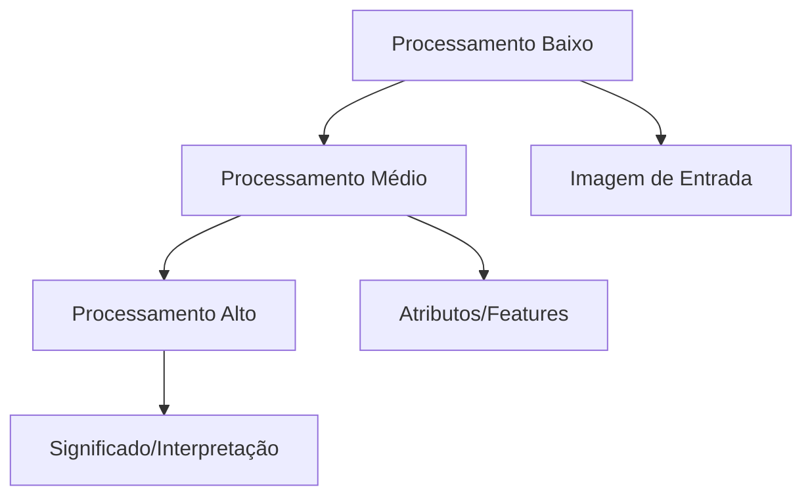
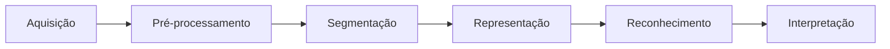

# Processamento de Imagens
> [!abstract] *"Uma imagem vale mais que mil palavras" - E agora, vamos ensinar computadores a ler essas palavras!*

> [!summary] ## 🎯 Visão Geral
**O Que é Processamento de Imagens?**
Respota: Processamento de Imagens (PI) consiste em **duas áreas principais**:
> ### 1. 🎨 Melhoria de Imagens
> - **Entrada**: Imagem
> - **Saída**: Imagem
> - **Objetivo**: Melhorar informação visual para interpretação humana
> - **Exemplos**: Redução de ruído, ajuste de contraste, realce de detalhes
>
> ### 2. 🤖 Percepção Automática
> - **Entrada**: Imagem
> - **Saída**: Dados/Informação
>- **Objetivo**: Máquinas percebam e entendam conteúdo automaticamente
> - **Exemplos**: Detecção de objetos, reconhecimento facial, segmentação

> [!note] ## 🏗️ Níveis de Processamento
> ### 🔻 Baixo Nível
>
> - **Operações primitivas**
> - Entrada e saída são **imagens**
> - *Exemplo*: Redução de ruído, aumento de contraste
>
> ### 🔷 Médio Nível
> - Extração de **regiões e formas**
> - Entrada: Imagem | Saída: **Atributos**
> - *Exemplo*: Detecção de bordas, contornos, objetos
>
> ### 🔺 Alto Nível
> - Adiciona **significado** aos objetos
> - Usa **Inteligência Artificial**
> - *Exemplo*: Reconhecimento semântico, tarefas cognitivas



## 🎨 Representação de Imagens Digitais

### 📐 Definição Matemática
```python
def return_img(img):
	for x,y in img:
		# sim, nós lemos em Y/X, não em X/Y
		pixel = img[y,x]
		red = img[y,x][0]
		green = img[y,x][1]
		blue = img[y,x][2]
	return img
```
- **x, y**: Coordenadas espaciais
- **f(x,y)**: Brilho/intensidade no ponto

![[Pasted image 20251001135626.png]]
![[Pasted image 20251001135706.png]]
> [!tip] ### 🧮 Pixel (Picture Element)
> - Elemento básico da imagem
> - Representado por valores de intensidade
> - Organizado em matriz bidimensional
> ![[Pasted image 20251001135735.png]]
> 
> A sua **Cor** é definida pela quantidade de bits que é alocada para cada canal, sendo que o **Bit** pode ser representado por 2 valores: 0 or 1
> 
> ![[Pasted image 20251001140126.png]]


> [!tldr] ### 🎛️ Modelos de Cor
> 
> #### Escala de Cinza
> representa apenas um canal para cada pixel, de $0$ á $256$ ou mesmo entre $0$ á $2^6\text{ bits}$
> ```python
> # 1 canal | Tons de cinza
> bits_por_canal = [1, 3, 8]
> tons_possiveis = [2, 8, 256]  # 2^bits
> ```
> ![[Pasted image 20251001140240.png]]

> [!note] #### RGB (True Color)
>O espaço de cor **RGB** é composto por **três canais**, cada um variando de **0 a 255** em intensidade.  
Esses canais são:  
> - 🔴 **Vermelho (Red)**  
> - 🟢 **Verde (Green)**  
> - 🔵 **Azul (Blue)**  
>
> A combinação desses três componentes define a cor de cada pixel em uma imagem digital.
> ```python
> # 3 canais: Red, Green, Blue
> # 24 bits = 8 bits por canal
> cores_possiveis = 2**24 ≈ 16 milhões
> ```
>
> #### Tabela RGB 3-bits
> | R | G | B | Cor       |
> |---|----|---|-----------|
> | 0 | 0 | 0 | Preto     |
> | 0 | 0 | 1 | Azul      |
> | 0 | 1 | 0 | Verde     |
> | 0 | 1 | 1 | Ciano     |
> | 1 | 0 | 0 | Vermelho  |
> | 1 | 0 | 1 | Magenta   |
> | 1 | 1 | 0 | Amarelo   |
> | 1 | 1 | 1 | Branco    |

![[Pasted image 20251001141215.png]]
## 🔄 Pipeline Fundamental


![[Pasted image 20251002220954.png]]
### 1. 📷 Aquisição de Imagens
- Sensores: câmeras, drones, tomógrafos
- **Digitalização**: Conversão analógica → digital

### 2. 🧹 Pré-processamento
- **Melhoramento** da imagem
- *Exemplos*: Remoção de ruído, realce de contraste

### 3. ✂️ Segmentação
- **Divisão** em partes/objetos
- **Tarefa mais difícil** do PI
- *Exemplo*: Segmentação de lesões médicas

### 4. 📊 Representação e Descrição
- **Representação**: Transformação para formato computacional
- **Descrição**: Extração de características
- *Exemplo*: Cálculo de área, perímetro

### 5. 🏷️ Reconhecimento e Interpretação
- **Reconhecimento**: Atribuição de rótulos
- **Interpretação**: Atribuição de significado
- *Exemplo*: Nódulos malignos/benignos

## 🔢 Modelo de Formação

### 📐 Digitalização
- **Amostragem**: Digitalização das coordenadas espaciais (x,y)
- **Quantização**: Digitalização da amplitude (níveis de cinza)

### 📈 Amostragem
```python
# Maior amostragem = Mais detalhes
imagem_1024x1024 = alta_resolução
imagem_32x32 = baixa_resolução
```

### 🎚️ Quantização
```python
# Mais bits = Mais tons
bits = [1, 2, 4, 8]
tons = [2, 4, 16, 256]  # 2^bits
```

### 📊 Efeitos Visuais
| Amostragem | Quantização | Resultado |
|------------|-------------|-----------|
| Alta | Alta | Imagem detalhada e suave |
| Baixa | Alta | Imagem pixelizada |
| Alta | Baixa | Imagem com poucos tons |
| Baixa | Baixa | Imagem muito simplificada |

## 💻 Hello World em PI

### 🐍 Código Básico

```python
import cv2
from matplotlib import pyplot as plt

# Carregar imagem em escala de cinza
imagem = cv2.imread('abelha.jpg', cv2.IMREAD_GRAYSCALE)

# Visualizar
plt.imshow(imagem, cmap='gray')
plt.title('"Hello, world!" em PI')
plt.axis('off')
plt.show()

# Propriedades da imagem
print(f"Tipo: {type(imagem)}")  # <class 'numpy.ndarray'>
print(f"Dimensões: {imagem.shape}")  # (altura, largura)
print(f"Intensidade no pixel (100,150): {imagem[100, 150]}")
```

### 🔄 Conversão RGB
```python
# OpenCV usa BGR, matplotlib usa RGB
imagem_bgr = cv2.imread('abelha.jpg', cv2.IMREAD_COLOR)
imagem_rgb = cv2.cvtColor(imagem_bgr, cv2.COLOR_BGR2RGB)

print(f"Dimensões coloridas: {imagem_rgb.shape}")  # (altura, largura, 3 canais)
```

## 🌍 Aplicações Práticas

### 🏥 Medicina
- Segmentação de lesões
- Diagnóstico assistido
- Análise de exames

### 🔒 Segurança
- Reconhecimento facial
- Biometria
- Detecção de placas

### 🌳 Meio Ambiente
- Monitoramento de desmatamento
- Detecção de vazamentos
- Análise de mudanças climáticas

### 🏭 Indústria
- Controle de qualidade
- Inspeção automatizada
- Reconhecimento de defeitos

## 🛠️ Ferramentas Recomendadas

### 🐍 Ambientes de Desenvolvimento
- **Anaconda Python** (offline)
- **Google Colab** (online com GPU)

### 📚 Bibliotecas Principais
- **OpenCV**: Processamento de imagens
- **Matplotlib**: Visualização
- **NumPy**: Manipulação de matrizes

## Operações

> [!info] ### Remoção de Ruído
> ![[Pasted image 20251002213149.png]]
>
> ![[Pasted image 20251002213203.png]]
> ![[Pasted image 20251002213525.png]]

> [!warning] Imagine o ruído como pontos aleatórias em uma imagem

> [!info] Ajuste de Contraste
> ![[Pasted image 20251002214217.png]]
> ![[Pasted image 20251002214442.png]]

> [!info] Detecção de Bordas
> ![[Pasted image 20251002214551.png]] 

> [!info] Detecção de ROI (Region Of Interesing)
> ![[Pasted image 20251002215737.png]]

> [!info] Detecção Facial
> ![[Pasted image 20251002215922.png]]

> [!info] Reconhecimento de PLacas e Digitais
> ![[Pasted image 20251002220008.png]]

> [!info] Detecção de Lesões
> 
> ![[Pasted image 20251002220053.png]]

> [!info] Compressão de Imagens
> ![[Pasted image 20251002215011.png]]

> [!info] Análise e aprendizado de Regiões de petróleo
> ![[Pasted image 20251002220253.png]]

> [!info] Detecção de Possíveis focos de Dengue
> ![[Pasted image 20251002220434.png]]

> [!info] INSTAGRAM, FACEBOOK, CRIAR UMA REDE SOCIAL
> ![[Pasted image 20251002220527.png]]

> [!info] Contagem de Pessoas, Objetos ou Animais
> ![[Pasted image 20251002220716.png]]

> [!info] Reconhecimento de Ações Humanas
> ![[Pasted image 20251002220824.png]]

> [!info] Aquisição de Escrituras
> ![[Pasted image 20251002221117.png]]

## 📚 Referências

### 📖 Livros
- GONZALEZ, R. C.; WOODS, R. E. *Processamento de Imagens Digitais*
- MARQUES, F. O.; NETO, H. V. *Processamento Digital de Imagens*

---
# Conteudo da Dsiciplina

# 📚 Conteúdo Programático - Processamento de Imagens

## 🎯 **MÓDULO 1: FUNDAMENTOS**

- [[Conceito de Imagem Digital]]
- [[Pixels e Matrizes]]

## 🔢 **MÓDULO 2: DIGITALIZAÇÃO E FUNDAMENTOS MATEMÁTICOS**

### 2.1 Realcionamento entre Pixels
 - [[Relações Entre Pixels]]
	 - [[Distância Euclidiana]]
	 - [[DIstancia ChessBoard (Xadrez)]]
	 - [[DIstancia City Block (Quarteirão)]]
	 - [[Operação de Adição]]
	 - [[Operação de Subtração]]
	 - [[Operação de Multiplicação]]
	 - [[Operação de Divisão]]
	 - [[Conexão - 4 Vizinhos]]
	 - [[Conexão - 8 vizinhos]]
	 - [[Conexão - Mista]]
	 - [[Operações Lógicas em Imagens]]

### 2.2 Fundamentos Matemáticos
- [[Sistemas de Coordenadas]]
- [[Operações com Matrizes]]
	- [[Matriz de Translação]]
	 - [[Matriz de Rotação]]
	 - [[Matriz de Escala]]
	 - [[Matriz de Espelhamento]]
	 - [[Matriz de Cislhamento]]
	 - [[Matriz de Projeção]]
	 - [[Matriz de Homografia ]]
- [[Transformadas]]
  - [[Transformada de Fourier]]
  - [[Transformada Discreta de Cosseno]]
- [[Interpolação em Imagens]]

## 🛠️ **MÓDULO 3: PRÉ-PROCESSAMENTO**

### 3.1 Modelos de Cores
-[[Modelos de Cor]]
  - [[Escala de Cinza]]
  - [[Modelo RGB]]
  - [[Modelo RGBA]]
  - [[Modelo CMY]]
  - [[Modelo CMYK]]
  - [[Modelo HSV]]
  - [[Modelo HSL]]
  - [[Modelo HSI]]
  - [[Modelo HSB]]
  - [[Modelo YUV]]
  - [[Modelo YIQ]]
  - [[Modelo YCbCr]]
  - [[Modelo CIE XYZ]]
  - [[Modelo CIELab]]
  - [[Modelo CIELuv]]
  - [[Modelo Hunter Lab]]
  - [[Modelo OHTA]]
  - [[Modelo I1I2I3]]
  - [[Modelo ICtCp]]
  - [[Modelo LMS]]
- [[Formatos de Arquivo]] (JPEG, PNG, BMP, TIFF)

### 3.1 Operações de Préprocessamento
 - [[Técnicas de Realce]]
- [[Correção Gama]]
- [[Histogramas]]
  - [[Equalização de Histograma]]
  - [[Especificação de Histograma]]

### 3.2 Filtragem Espacial
- [[Filtros de Suavização]]
  - [[Média]]
  - [[Gaussiano]]
  - [[Mediana]]
- [[Filtros de Aguçamento]]
  - [[Laplaciano]]
  - [[Sobel]]
  - [[Prewitt]]
  - [[Convolução]]

## ✂️ **MÓDULO 4: SEGMENTAÇÃO**

### 4.1 Segmentação Baseada em Limiar
- [[Limiarização Global]]
- [[Limiarização Adaptativa]]
- [[Método de Otsu]]

### 4.2 Segmentação Baseada em Bordas
- [[Detectores de Bordas]]
- [[Operador Canny]]
- [[Linking de Bordas]]
- [[Bordas Sobel]]
- [[Bordas Prewitt]]
- [[Bordas Laplacian]]

### 4.3 Segmentação Baseada em Regiões
- [[Crescimento de Regiões]]
- [[Split and Merge]]
- [[Watershed]]
- [[Region Frowing]]
- [[ML - K Means]]
- [[Segmentação com SuperPixel]]
- [[Métricas de Validação]]

## 📊 **MÓDULO 5: DESCRIÇÃO E REPRESENTAÇÃO**

### 5.1 Descritores de Forma
- [[Momento de Imagem]]
- [[Descritores de Fourier]]
- [[Assinaturas]]
- [[Detecção de Fronteira]]
- [[Descritores de Contorno]]
- [[Descritor de Curvatura]]
- [[Descritor de Comprimento]]
- [[Descirtor de Diâmetro]]
- [[Cadeia de Freeman]]
- [[Aproximação poligonal]]
### 5.2 Descritores de Textura
- [[Matriz de Co-ocorrência]]
- [[Filtros de Gabor]]
- [[LBP (Local Binary Patterns)]]

### 5.3 Descritores de Cor
- [[Histogramas de Cor]]
- [[Momento de Cor]]
- [[Espaços de Cor para Descrição]]

## 🧠 **MÓDULO 6: RECONHECIMENTO DE PADRÕES**

### 6.1 Fundamentos de Classificação
- [[Extração de Características]]
- [[Seleção de Features]]
- [[Espaço de Características]]

### 6.2 Classificadores
- [[ML - K-nearest Neighbor]]
- [[ML - SVM Maquina Vetorial de Suporte]]
- [[ML - Redes Neurais]]
- [[ML - Arvores de Decisão]]

## 🌈 **MÓDULO 7: PROCESSAMENTO DE COR**

### 7.1 Fundamentos de Cor
- [[Espaços de Cor]]
- [[Conversão entre Espaços de Cor]]
- [[Processamento em Canais Separados]]

### 7.2 Aplicações com Cor
- [[Segmentação Baseada em Cor]]
- [[Retrieval por Cor]]
- [[Análise de Textura Colorida]]

## 📐 **MÓDULO 8: PROCESSAMENTO MORFOLÓGICO**

### 8.1 Operações Morfológicas Básicas
- [[Erosão e Dilatação]]
- [[Abertura e Fechamento]]
- [[Operações em Escala de Cinza]]

### 8.2 Técnicas Avançadas
- [[Esqueletização]]
- [[Extração de Contornos]]
- [[Preenchimento de Regiões]]

## 🔍 **MÓDULO 9: ANÁLISE DE OBJETOS**

### 9.1 Análise de Componentes Conectados
- [[Rotulação de Componentes]]
- [[Descritores de Regiões]]
- [[Análise de Forma]]

### 9.2 Medidas de Objetos
- [[Área e Perímetro]]
- [[Centróide e Orientação]]
- [[Razão de Aspecto e Circularidade]]

## 🎥 **MÓDULO 10: PROCESSAMENTO DE VÍDEO**

### 10.1 Fundamentos de Vídeo
- [[Conceitos de Vídeo Digital]]
- [[Aquisição de Vídeo]]
- [[Diferenças Imagem-Vídeo]]

### 10.2 Processamento de Sequências
- [[Estabilização de Vídeo]]
- [[Detecção de Movimento]]
- [[Rastreamento de Objetos]]

## 💻 **MÓDULO 11: FERRAMENTAS E PRÁTICA**
 
- [[Sistema de Detecção de Faces]]
- [[Classificador de Lesões de Pele]]
- [[Sistema de OCR Básico]]
- [[Filtros Criativos para Imagens]]

## 📈 **MÓDULO 12: TÓPICOS AVANÇADOS**

### 12.1 Técnicas Modernas
- [[Processamento Multiescala]]
- [[Wavelets]]
- [[Deep Learning para Imagens]]

### 12.2 Aplicações Específicas
- [[Processamento de Imagens Médicas]]
- [[Visão Computacional para Robótica]]
- [[Análise de Imagens de Satélite]]

---

**🔗 Conexões com Outras Disciplinas:**
- [[Estruturas de Dados]]
- [[Inteligência Artificial]]
- [[Computação Gráfica]]

*Cada tópico listado pode ser expandido em uma página específica do Obsidian com teoria, exemplos e exercícios!* 📖✨
